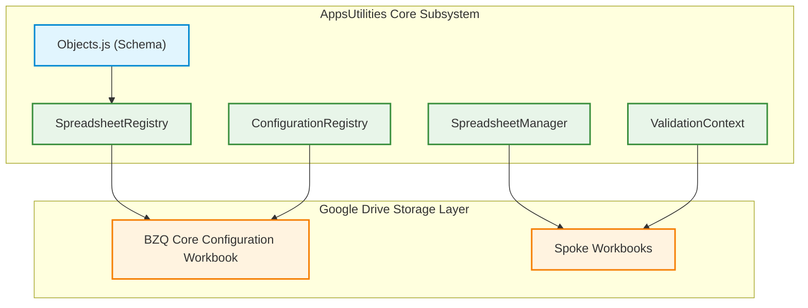
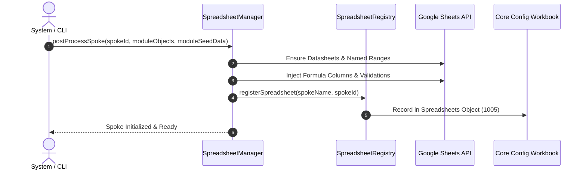
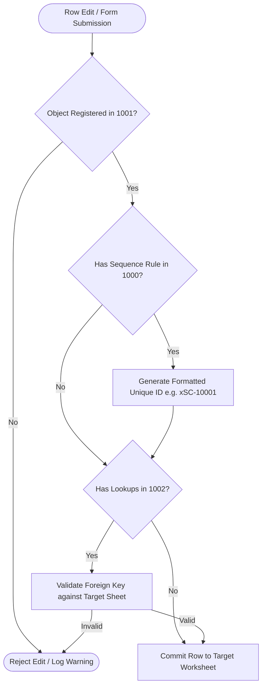

# BZQ ERP Core Application (`AppsUtilities`)

The **AppsUtilities** module serves as the foundational operating core of the **BZQ ERP** platform. It provides the core business object registries, sequence generation engines, cross-workbook relational lookup resolution, data validation services, and global configuration management.

---

## 1. Module Identity & Purpose

- **Module Name (ID)**: `AppsUtilities`
- **Display Name**: BZQ ERP Core Application
- **Stable Object Range**: `1000` – `1999`
- **Business Purpose**: Orchestrates core spreadsheet data structures, relational integrity, auto-sequencing, and validation across all modular spoke worksheets and Google Drive containers.

---

## 2. Developer & Maintainer Information

- **Organization**: HSOM Advisors
- **Email**: [bzqinfo@hsomadvisors.com](mailto:bzqinfo@hsomadvisors.com)
- **Address**: 
- **Phone**: 

---

## 3. Module Dependencies

`AppsUtilities` is the root foundational module in BZQ ERP. It has zero upstream module dependencies.

| Dependency Module | Required Stable ID Range | Notes |
| :--- | :--- | :--- |
| *(None)* | Root Module | Serves as the base library for all other BZQ modules. |

---

## 4. Architecture & Process Flows

### 4.1 Component Architecture


### 4.2 Spoke Sheet Creation & Configuration Seeding Sequence


### 4.3 Process Flow: Data Validation & ID Generation


---

## 5. Module BZQ Objects

The following objects are declared and managed by `AppsUtilities`. Source code definitions are located in [`Objects.js`](./Objects.js).

| Object Name | Stable ID | Full Stable ID | Datasheet | Primary Key Field(s) | ID Field | Sequence Prefix | Description |
| :--- | :--- | :--- | :--- | :--- | :--- | :--- | :--- |
| **Sequence** | `1000` | `AppsUtilities.1000` | `SequenceConfiguration` | `Sequence Name` | `Sequence Number` | `xSC-` | Defines auto-incrementing document numbering rules, prefixes, and formatting. |
| **Object** | `1001` | `AppsUtilities.1001` | `ObjectConfiguration` | `Object Name` | `Object Number` | `xOC-` | Central registry of business objects, worksheets, and validation bindings. |
| **Lookup** | `1002` | `AppsUtilities.1002` | `LookupConfiguration` | `Lookup Name` | `Lookup Number` | `xLC-` | Defines foreign key relational bindings and dynamic lookup helper sheet rules. |
| **Dropdown** | `1003` | `AppsUtilities.1003` | `DropdownConfiguration` | `Dropdown Name` | `Dropdown Number` | `xDC-` | Defines static dropdown value sets scoped to specific business objects. |
| **GlobalDropdown** | `1004` | `AppsUtilities.1004` | `GlobalDropdownConfiguration` | `Global Dropdown Name` | `Global Dropdown Number` | `xGD-` | Defines global dropdown value sets accessible system-wide across all worksheets. |
| **Spreadsheet** | `1005` | `AppsUtilities.1005` | `Spreadsheets` | `Spreadsheet Name` | `Spreadsheet Number` | `xSS-` | Maintains registry of physical Google Drive workbooks and container links. |
| **ConfigurationProperty** | `1006` | `AppsUtilities.1006` | `ConfigurationProperties` | `Configuration Key` | `Property Number` | *(None)* | System key-value runtime configuration properties and feature toggles. |

---

## 6. Development & Deployment

To push changes to this module's Apps Script project:

```bash
# Push to active Apps Script project
./bzq push AppsUtilities

# Deploy a versioned release
./bzq deploy AppsUtilities "Release description"
```
