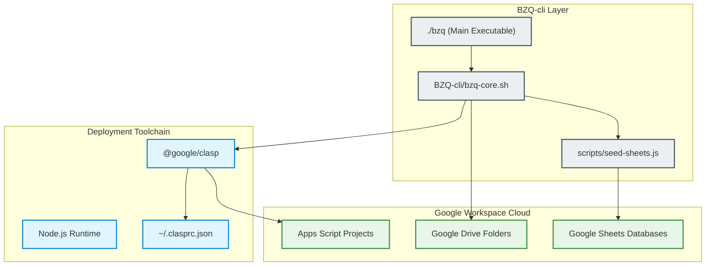
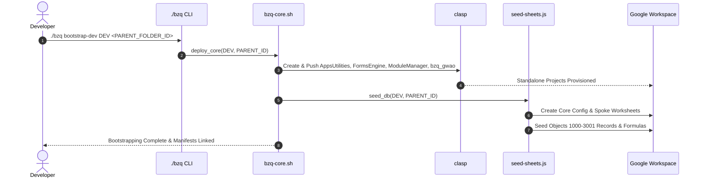

# BZQ CLI (`BZQ-cli`)

The **BZQ CLI** (`BZQ-cli`) provides local development tooling, environment orchestration, automated clasp project management, and database seeding utilities for the **BZQ ERP** platform.

---

## 1. Module Identity & Purpose

- **Tool Name (ID)**: `BZQ-cli`
- **Display Name**: BZQ CLI
- **Executable**: `./bzq` (root wrapper) and `BZQ-cli/bzq-core.sh`
- **Business Purpose**: Streamlines developer onboarding, cold environment provisioning, continuous deployment, and schema seeding for the multi-project BZQ ecosystem.

---

## 2. Developer & Maintainer Information

- **Organization**: HSOM Advisors
- **Email**: [bzqinfo@hsomadvisors.com](mailto:bzqinfo@hsomadvisors.com)
- **Address**: 
- **Phone**: 

---

## 3. CLI Architecture & Workflow

### 3.1 Component Architecture


### 3.2 Environment Bootstrapping Sequence


---

## 4. Command Reference

| Command | Usage | Description |
| :--- | :--- | :--- |
| **`login`** | `./bzq login` | Authenticate clasp with your Google Account. |
| **`init`** | `./bzq init <folder> [parent-id]` | Initialize a new Google Apps Script project. |
| **`pull`** | `./bzq pull <folder> [script-id]` | Pull latest code down from Google Apps Script. |
| **`push`** | `./bzq push [<folder> \| --all]` | Push local code to Google Apps Script. |
| **`deploy`** | `./bzq deploy <folder> [desc]` | Create a versioned deployment in Apps Script. |
| **`status`** | `./bzq status [<folder>]` | Show project configuration and git/clasp status. |
| **`open`** | `./bzq open <folder>` | Open project in the Apps Script online editor. |
| **`bootstrap-dev`** | `./bzq bootstrap-dev <env> <parent-id>` | Complete cold deployment and database seeding. |
| **`deploy-core`** | `./bzq deploy-core <env> <parent-id>` | Provision the 4 core standalone projects. |
| **`seed-db`** | `./bzq seed-db <env> <parent-id>` | Seed configuration databases and worksheets. |
| **`install-module`** | `./bzq install-module <module> <env> <id>` | Deploy and configure an individual module. |

---

## 5. Environment Configuration

During bootstrapping, `BZQ-cli` automatically generates a local, git-ignored `EnvConfig.js` in each project directory containing the active environment parameters:

```javascript
// EnvConfig.js (Auto-generated, git-ignored)
var BZQ_ENV = "DEV";
var BZQ_PARENT_FOLDER_ID = "1abc...xyz";
var BZQ_CONFIG_SS_ID = "1sheet...id";
```
