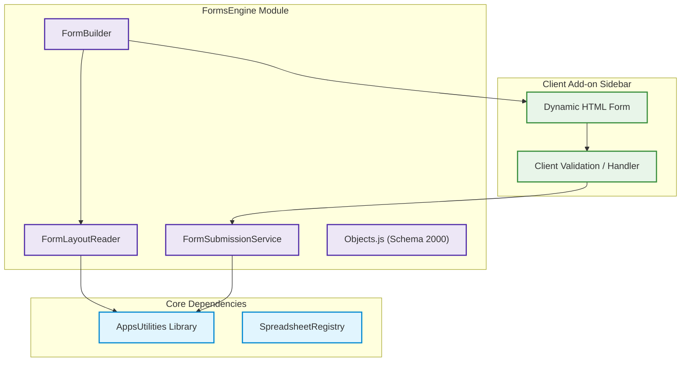
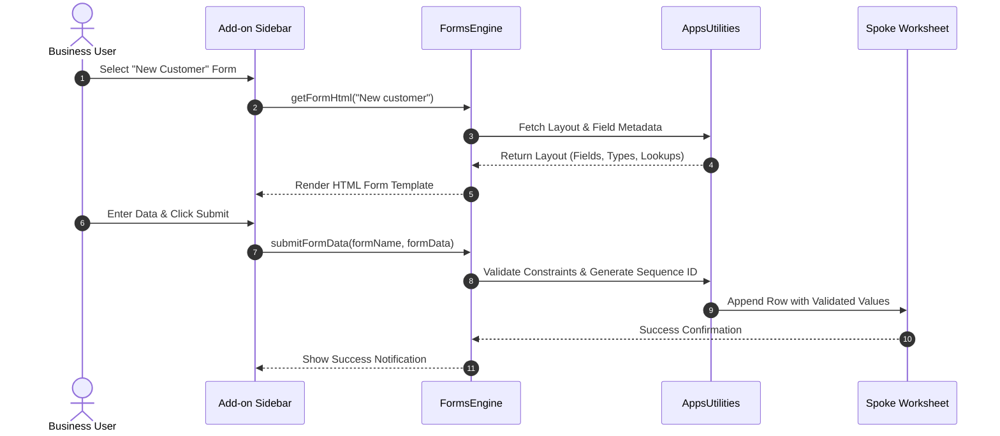
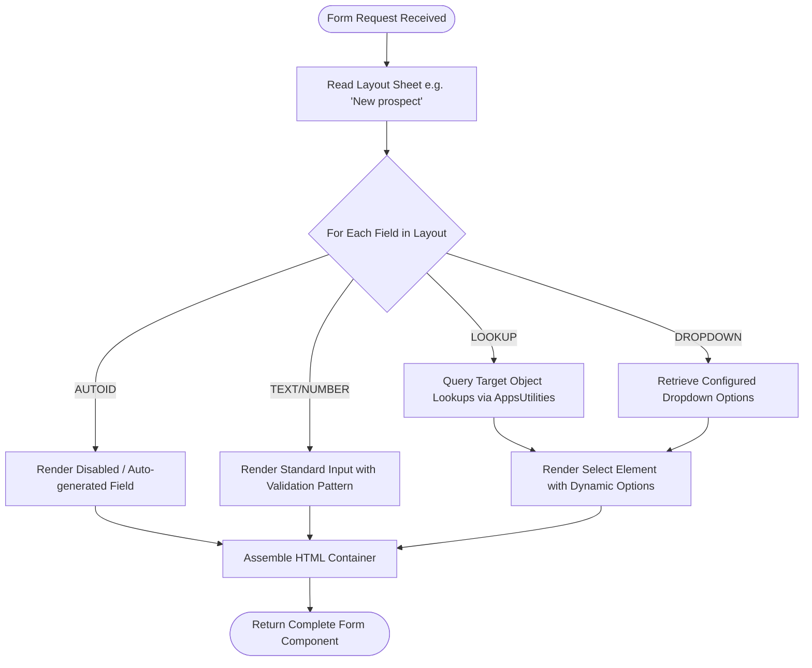

# Entry Forms Engine (`FormsEngine`)

The **FormsEngine** module is the data capture and UI rendering subsystem of **BZQ ERP**. It dynamically generates responsive HTML forms, sidebars, and modals from declarative spreadsheet layouts and metadata schemas.

---

## 1. Module Identity & Purpose

- **Module Name (ID)**: `FormsEngine`
- **Display Name**: Entry Forms Engine
- **Stable Object Range**: `2000` – `2999`
- **Business Purpose**: Translates declarative form layout tables in Google Sheets into interactive, validated HTML sidebar and dialog interfaces for rapid ERP data entry.

---

## 2. Developer & Maintainer Information

- **Organization**: HSOM Advisors
- **Email**: [bzqinfo@hsomadvisors.com](mailto:bzqinfo@hsomadvisors.com)
- **Address**: 
- **Phone**: 

---

## 3. Module Dependencies

`FormsEngine` depends directly on `AppsUtilities` for object registry lookups, sequences, dropdowns, and data validation.

| Dependency Module | Required Stable ID Range | Notes |
| :--- | :--- | :--- |
| **`AppsUtilities`** | `1000` – `1006` | Provides core object definitions, sequence generation, and relational lookups. |

---

## 4. Architecture & Process Flows

### 4.1 Component Architecture


### 4.2 Form Rendering & Submission Sequence


### 4.3 Process Flow: Dynamic Field Layout Engine


---

## 5. Module BZQ Objects

The following objects are declared and managed by `FormsEngine`. Source code definitions are located in [`Objects.js`](./Objects.js).

| Object Name | Stable ID | Full Stable ID | Datasheet | Primary Key Field(s) | ID Field | Sequence Prefix | Description |
| :--- | :--- | :--- | :--- | :--- | :--- | :--- | :--- |
| **Form** | `2000` | `FormsEngine.2000` | `Forms` | `Form Name` | `Form Number` | `xFM-` | Defines dynamic HTML form layouts, field mappings, and submission validation rules. |

---

## 6. Development & Deployment

To push changes to this module's Apps Script project:

```bash
# Push to active Apps Script project
./bzq push FormsEngine

# Deploy a versioned release
./bzq deploy FormsEngine "Release description"
```
