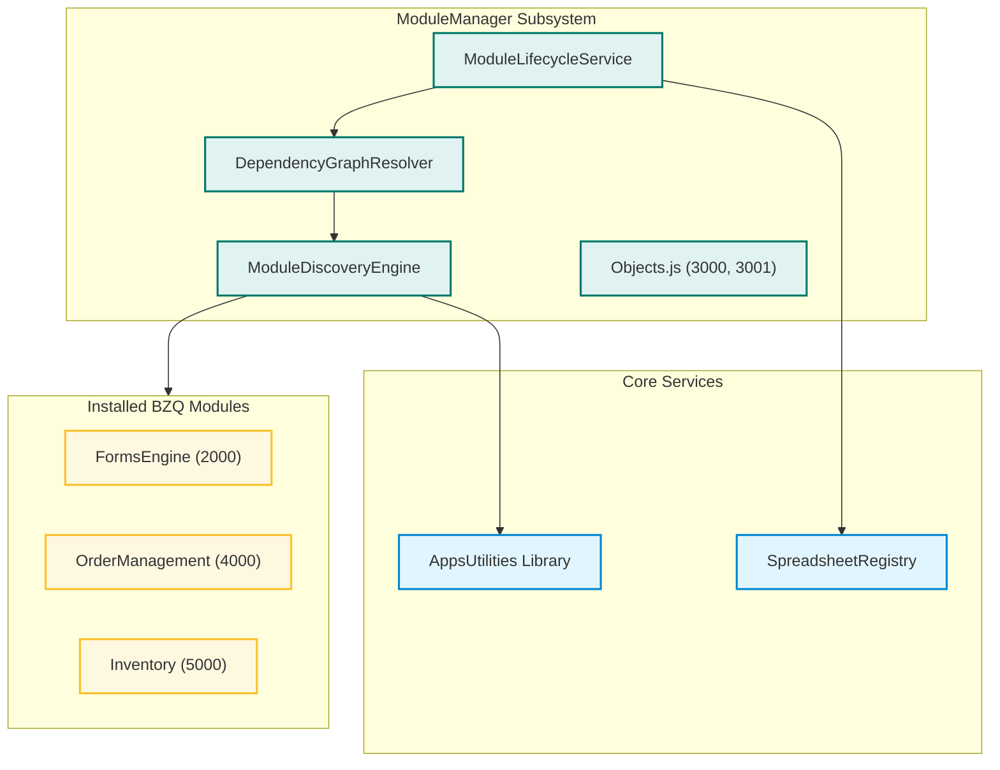
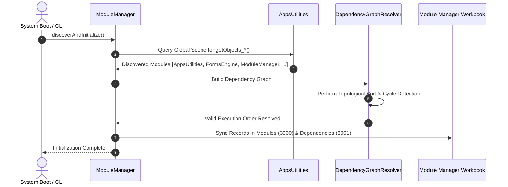
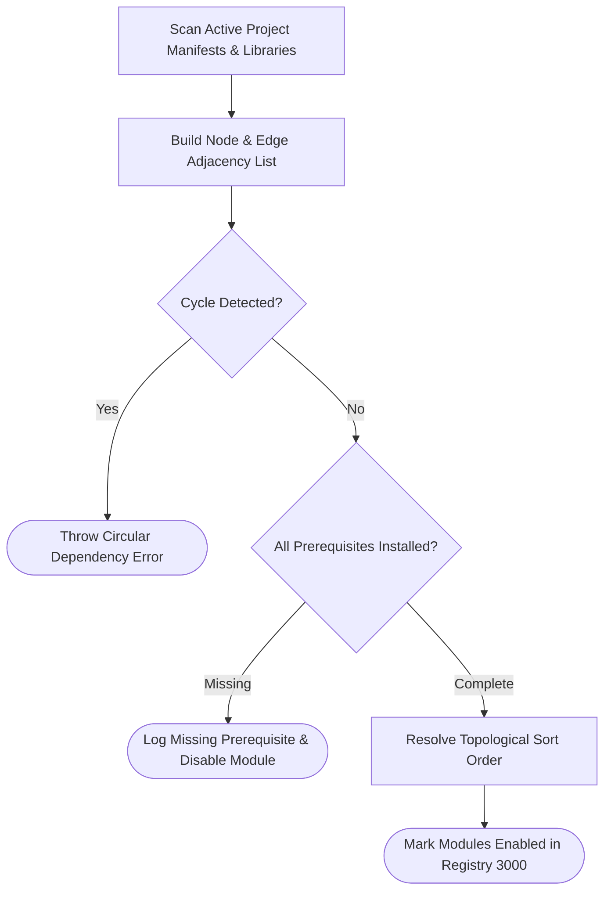

# Module Manager (`ModuleManager`)

The **ModuleManager** module orchestrates the modular ecosystem of **BZQ ERP**. It provides automated module discovery, dependency graphing, topological order execution, and lifecycle status tracking across all installed extensions.

---

## 1. Module Identity & Purpose

- **Module Name (ID)**: `ModuleManager`
- **Display Name**: Module Manager
- **Stable Object Range**: `3000` – `3999`
- **Business Purpose**: Dynamically discovers installed BZQ modules, verifies prerequisite dependency hierarchies, and coordinates system-wide lifecycle initialization.

---

## 2. Developer & Maintainer Information

- **Organization**: HSOM Advisors
- **Email**: [bzqinfo@hsomadvisors.com](mailto:bzqinfo@hsomadvisors.com)
- **Address**: 
- **Phone**: 

---

## 3. Module Dependencies

`ModuleManager` depends on `AppsUtilities` for core database storage, object configuration registries, and sequence generation.

| Dependency Module | Required Stable ID Range | Notes |
| :--- | :--- | :--- |
| **`AppsUtilities`** | `1000` – `1006` | Provides core object registries and sequence generation. |

---

## 4. Architecture & Process Flows

### 4.1 Component Architecture


### 4.2 Module Discovery & Dependency Resolution Sequence


### 4.3 Process Flow: Dependency Validation


---

## 5. Module BZQ Objects

The following objects are declared and managed by `ModuleManager`. Source code definitions are located in [`Objects.js`](./Objects.js).

| Object Name | Stable ID | Full Stable ID | Datasheet | Primary Key Field(s) | ID Field | Sequence Prefix | Description |
| :--- | :--- | :--- | :--- | :--- | :--- | :--- | :--- |
| **Module** | `3000` | `ModuleManager.3000` | `Modules` | `Module Name` | `Module Number` | `xMD-` | Maintains registry of modular extensions, version descriptors, and lifecycle status. |
| **ModuleDependency** | `3001` | `ModuleManager.3001` | `Module Dependencies` | `Dependency Number` | `Dependency Number` | `xDD-` | Defines directed dependency graphs and prerequisite requirements between modules. |

---

## 6. Development & Deployment

To push changes to this module's Apps Script project:

```bash
# Push to active Apps Script project
./bzq push ModuleManager

# Deploy a versioned release
./bzq deploy ModuleManager "Release description"
```
