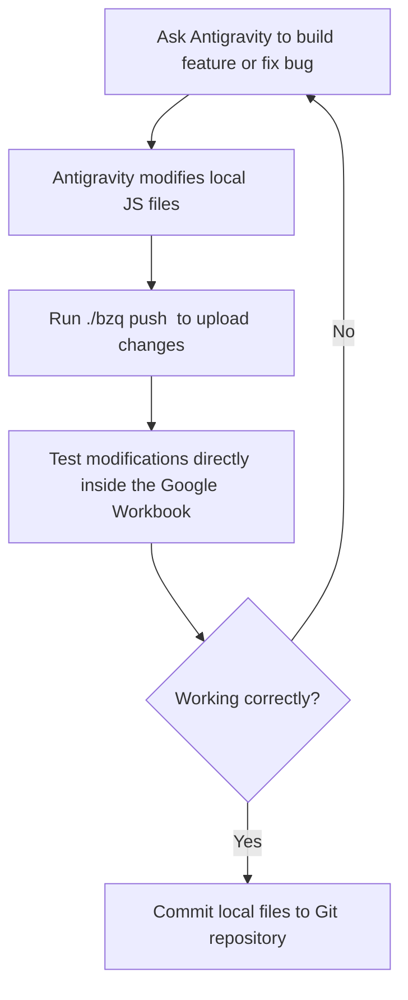

# Biz Qops (pronounced "Biz Chops")

Biz Qops is a business management suite built directly on top of out-of-the-box **Google Workspace** services. It allows small and mid-sized businesses to run core operations such as accounting, sales, point of sale (POS), and vendor management—without expensive third-party subscriptions.

---

## 📂 Repository Structure

The platform is built around a modular architecture where each Google Workspace/Sheets workbook acts as an independent application component linked to a local Git directory:

```text
ESR-Biz_Qops/
├── .gitignore              # Project exclusions
├── README.md               # Onboarding and architecture documentation
├── bzq                     # Master CLI entrypoint (Biz Chops manager)
├── AppsUtilities/          # Core library (business objects, sheet properties, sequencing)
│   ├── .clasp.json         # Apps Script linkage (Git ignored secrets protected)
│   ├── .claspignore        # Target folders upload prevention
│   └── appsscript.json     # Apps Script Manifest
└── BZQ-cli/                # Core CLI source
    ├── bzq-core.sh         # Helper functions and CLI engines
    └── .claspignore-template
```

### Planned Modules
As the suite expands, new directories will follow the same pattern as `AppsUtilities`:
- **`FormsEngine/`** - Dynamic forms schema definition and handling.
- **`AccountingEngine/`** - Ledgers, double-entry transactions, and financial reporting.
- **`SalesEngine/`** - Customer pipelines, CRM integrations, and invoice trackers.
- **`PosEngine/`** - Retail Point-Of-Sale registers and barcode sheet mapping.
- **`VendorManagement/`** - Purchase ordering, supply chains, and vendor ratings.

---

## 🛠️ Onboarding: From Scratch to Development

Follow these steps to set up your local development environment:

### 1. Prerequisites
Ensure you have **Node.js** installed on your system. You can check your version by running:
```bash
node -v
```

### 2. Authenticate with Google
Run the built-in login tool. This will launch a standard Google OAuth consent screen in your web browser:
```bash
./bzq login
```
*Note: Your credentials are saved securely in your system's user home directory (`~/.clasprc.json`) and are never committed to Git.*

### 3. Sync Down a Module
To clone an existing Google Sheets script project (for example, `AppsUtilities`) for the first time, obtain its **Script ID** (found in your Apps Script Project Settings -> Settings -> Script ID) and run:
```bash
./bzq pull AppsUtilities <SCRIPT_ID>
```
This initializes the directory, generates `.clasp.json`, downloads all your online `.gs` files as standard local `.js` files, and sets up a local `.claspignore` ruleset.

---

## 🤖 Developing and Deploying with Antigravity

Antigravity is your autonomous AI coding partner. By combining the power of local JavaScript development with clasp, you can safely write, refactor, and deploy code without risking workbook data corruption.

### The Development Workflow



### Best Practices:
1. **Interactive Development:** 
   When working on UI widgets, custom sidebars, or complex sheet bindings, tell Antigravity what you want. It will modify your local JavaScript and HTML source files inside your module folder.
2. **Real-time Synchronization:**
   To automatically push saves to your Google Sheets document while editing code, run:
   ```bash
   ./bzq push AppsUtilities --watch
   ```
   Any change saved locally will reflect in Google Sheets within 2 seconds.
3. **Version Control Integration:**
   Always run Git commands on your local environment to track code history.
   ```bash
   git add AppsUtilities/
   git commit -m "feat: implement document sequence manager"
   ```
4. **Deploying Releases:**
   Once testing is successful, tag your deployment via the CLI:
   ```bash
   ./bzq deploy AppsUtilities "Release Description"
   ```
