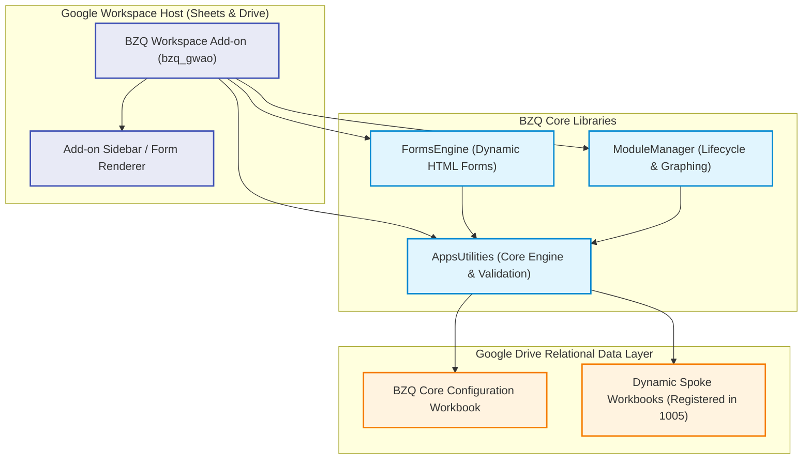

# BZQ ERP

**BZQ ERP** is a modular enterprise resource planning platform built natively on **Google Workspace**. It provides core business operations—such as auto-sequencing, relational object validation, dynamic HTML forms, module discovery, and workflow automation—directly inside Google Sheets and Google Drive via a centralized **Google Workspace Add-on (`bzq_gwao`)**.

---

## 🏗️ System Architecture



---

## 📂 Repository Structure

```text
BZQ/
├── bzq                        # Master BZQ CLI entrypoint
├── bzq_gwao/                  # Central Google Workspace Add-on Host (CardService & UI)
├── AppsUtilities/             # Core library (Objects 1000-1006, Sequencing, Validation)
├── FormsEngine/               # Dynamic HTML entry form renderer (Object 2000)
├── ModuleManager/             # Module discovery & dependency graphing (Objects 3000-3001)
├── BZQ-cli/                   # Core CLI helper scripts and templates
├── docs/                      # Central Diátaxis documentation suite
└── scripts/                   # Database seeding and migration automation
```

---

## 🚀 Quickstart: Developer Onboarding

### 1. Prerequisites
Ensure you have **Node.js 20+** installed:
```bash
node -v
```

### 2. Authenticate with Google
Log into Google Apps Script via the CLI:
```bash
./bzq login
```

### 3. Bootstrap a Development Sandbox
Create a target development folder in your Google Drive, copy its folder ID, and run:
```bash
./bzq bootstrap-dev DEV <DRIVE_FOLDER_ID>
```
This automated command:
1. Provisions and deploys the 4 standalone Apps Script projects (`AppsUtilities`, `FormsEngine`, `ModuleManager`, `bzq_gwao`).
2. Configures local, git-ignored `EnvConfig.js` environment files.
3. Automatically creates and seeds the `BZQ Core Configuration` spreadsheet and spoke databases.

### 4. Install in Developer Mode
1. Open the Add-on in Apps Script: `./bzq open bzq_gwao`.
2. Click **Deploy** -> **Test deployments** in the top toolbar.
3. Under **BZQ ERP**, click **Install** for Sheets and Drive.
4. Refresh Google Sheets or Google Drive; the BZQ icon will appear in the companion sidebar!

---

## 📚 Complete Documentation Suite

All system architecture, developer guides, and reference manuals are organized using the **Diátaxis Framework** in the **[`docs/`](docs/README.md)** directory:

* 🎓 **[Tutorials (Modular Seeding & Development)](docs/MODULAR_SEEDING_AND_DEVELOPMENT.md)**
* 🛠️ **[How-To: Testing & Browser Automation](docs/TESTING_AND_BROWSER_AUTOMATION.md)**
* 🛠️ **[How-To: Deployment & Multi-Tenant ALM](docs/DEPLOYMENT_AND_ALM.md)**
* 🛠️ **[How-To: Release Process & CI/CD](docs/RELEASE_PROCESS_AND_ALM.md)**
* 📖 **[Reference: Module Specifications & Standards](docs/MODULE_SPECIFICATIONS_AND_STANDARDS.md)**
* 💡 **[Explanation: BZQ ERP Architecture & Services Map](docs/ARCHITECTURE.md)**
* 🗺️ **[Roadmaps: Add-on Lifecycle & Dynamic Seeding Roadmap](docs/ADDON_LIFECYCLE_ROADMAP.md)**

For the full navigation map, see **[`docs/README.md`](docs/README.md)**.
