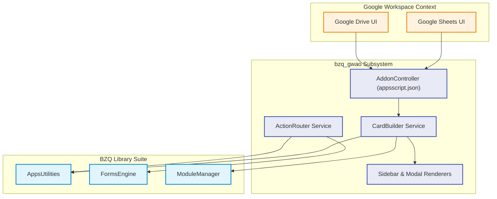
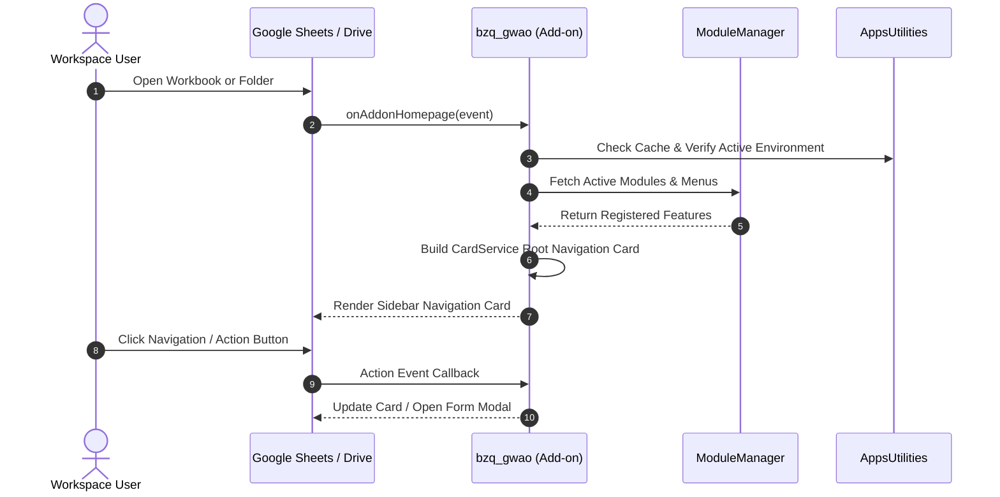
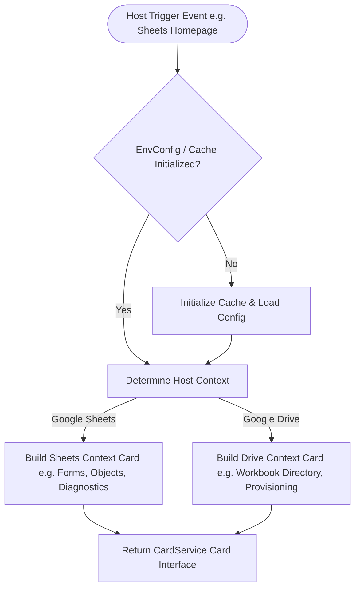

# BZQ Google Workspace Add-on (`bzq_gwao`)

The **bzq_gwao** module is the central user-facing Google Workspace Add-on (GWAO) host application. It integrates directly into Google Sheets and Google Drive, delivering interactive sidebars, contextual cards, workflow triggers, and administrative dashboards.

---

## 1. Module Identity & Purpose

- **Module Name (ID)**: `bzq_gwao`
- **Display Name**: BZQ Google Workspace Add-on
- **Role**: Host Application & CardService UI Controller
- **Business Purpose**: Unifies all BZQ ERP modules into a single, cohesive Google Workspace sidebar experience across Sheets and Drive.

---

## 2. Developer & Maintainer Information

- **Organization**: HSOM Advisors
- **Email**: [bzqinfo@hsomadvisors.com](mailto:bzqinfo@hsomadvisors.com)
- **Address**: 
- **Phone**: 

---

## 3. Module Dependencies

`bzq_gwao` acts as the root consumer and aggregator of all core BZQ libraries.

| Dependency Module | Minimum Version | Purpose |
| :--- | :--- | :--- |
| **`AppsUtilities`** | `v1.0.0+` | Core object registry, caching, configuration, and validation services. |
| **`FormsEngine`** | `v1.0.0+` | Dynamic HTML form generation and modal submission controllers. |
| **`ModuleManager`** | `v1.0.0+` | Module lifecycle status, menu registration, and feature flags. |

---

## 4. Architecture & Process Flows

### 4.1 Component Architecture


### 4.2 Workspace Add-on Lifecycle & Card Trigger Sequence


### 4.3 Process Flow: Contextual Routing


---

## 5. Module BZQ Objects

`bzq_gwao` is a pure consumer application shell and does not declare its own spoke worksheets. It dynamically consumes and visualizes objects defined by upstream modules:

- **AppsUtilities**: `1000` (Sequence), `1001` (Object), `1002` (Lookup), `1003` (Dropdown), `1004` (GlobalDropdown), `1005` (Spreadsheet), `1006` (ConfigurationProperty)
- **FormsEngine**: `2000` (Form)
- **ModuleManager**: `3000` (Module), `3001` (ModuleDependency)

---

## 6. Development & Deployment

### 6.1 Pushing & Deploying
```bash
# Push Add-on code to Google Apps Script
./bzq push bzq_gwao

# Deploy a versioned release
./bzq deploy bzq_gwao "Add-on v1.0.0"
```

### 6.2 Testing in Developer Mode
1. Open the script in the Apps Script editor via `./bzq open bzq_gwao`.
2. Click **Deploy** -> **Test deployments** in the top-right toolbar.
3. Under **BZQ ERP**, click **Install** for Sheets and Drive.
4. Refresh Google Sheets or Google Drive; the BZQ icon will appear in the right companion sidebar.
