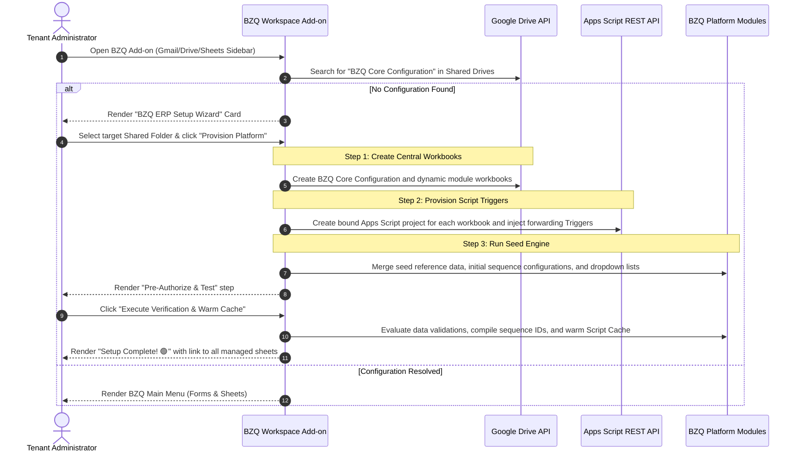

# BZQ Workspace Add-on-Driven Lifecycle & Seeding Roadmap

This document outlines the strategic roadmap for transitioning BZQ's database seeding, spreadsheet creation, script provisioning, and environment verification from the local Node.js developer-only command-line interface (CLI) to a native **Workspace Add-on-driven administrator setup wizard**.

By executing this roadmap, we will align the developer's sandbox setup 100% with the production tenant lifecycle, enabling zero-touch domain deployment directly from a private or public Google Workspace Marketplace install.

---

## 🎯 The Ultimate Production Vision

When a Workspace Administrator installs BZQ from the Google Workspace Marketplace, they will experience a seamless, self-service setup flow fully contained within Google's secure perimeter:



---

## 🗺️ Phase-by-Phase Short-Term Roadmap

We will implement and test this transition in **five highly structured, manageable chunks** over a few days.

```
┌────────────────────────────────────────────────────────┐
│  Phase 1: Admin Provisioning Panel & Wizard UI Core     │ (Day 1)
├────────────────────────────────────────────────────────┤
│  Phase 2: Add-on-Driven Central Workbook Creation      │ (Day 2)
├────────────────────────────────────────────────────────┤
│  Phase 3: Add-on-Driven Spoke Provisioning & Linking  │ (Day 3)
├────────────────────────────────────────────────────────┤
│  Phase 4: Add-on-Driven Database Seeding Engine        │ (Day 4)
├────────────────────────────────────────────────────────┤
│  Phase 5: Self-Service Verification & Warm Cache Panel │ (Day 5)
└────────────────────────────────────────────────────────┘
```

---

### 📅 Phase 1: Admin Provisioning Panel & Wizard UI Core
**Objective**: Build a high-quality "Admin Control Panel" card in the Workspace Add-on UI, serving as the interactive entry point for platform installation.

#### Tasks:
1. **Dynamic Homepage Routing**: Add a security utility `isUserTenantAdmin()` to detect if the active user is an administrator. If true, display an **"⚙️ Platform Admin Control Panel"** button on the homepage card.
2. **Setup Wizard Navigation Card**: Design a multi-step card layout that lists each workbook in the environment layout and reports its current state:
   - 🔴 **Central Configuration**: Not Found / Ready to Create
   - 🔴 **Query Engine Library**: Not Found (Go-Live requirement. Pure Apps Script library module; does not require a dedicated spreadsheet. Acts as the transactional layer between AppsUtilities and CRUD operations on data in BZQ sheets.)
   - 🔴 **Dynamic Module Spreadsheets**: (Discovered dynamically via Module definitions. No hardcoded names or sheets are assumed.)
3. **Interactive Target Folder Selection**: Guide the admin to select an existing Shared Folder inside a Shared Drive as the root path, and store its ID in script-level Document Properties.

#### Test Criteria:
* Open the Workspace Add-on sidebar in a personal My Drive sandbox.
* The Add-on detects that the Configuration workbook does not exist and renders the Setup Wizard with 🔴 status indicators.
* Enter a target folder search, select a folder, and assert that the folder ID updates successfully.

---

### 📅 Phase 2: Add-on-Driven Central Workbook Creation
**Objective**: Migrate central workbook creation and schema definition from local Node.js scripts to the GWAO's `SpreadsheetRegistry`.

#### Tasks:
1. **Dynamic Schema Compilation**: Discover schemas, worksheet names, and headers dynamically by parsing active module `Objects.js` and `Data.js` declarations. No hardcoded schemas are permitted.
2. **Dynamic Spreadsheet Generation**: Implement a dynamic creator that:
   - Solves the chicken-and-egg scenario by first compiling the local code definitions of `AppsUtilities` to create the `BZQ Core Configuration` workbook.
   - Writes the initial seed configuration rows.
   - Automatically reads the compiled spreadsheet lists of all active modules from their respective `Objects.js`/`Data.js` to create other required spreadsheets dynamically.
3. **Dynamic Spreadsheet Registry Record**: Programmatically record all generated spreadsheet IDs in the central `Spreadsheets` table (Object `AppsUtilities.1005`) inside the BZQ Core Configuration workbook.

#### Test Criteria:
* Click the "Initialize Central Workbooks" button in the GWAO setup wizard card.
* Assert that three correctly-named spreadsheets are generated inside the designated Google Drive folder.
* Verify that each spreadsheet contains the correct tabs, structured header rows, and formatted column structures.

---

### 📅 Phase 3: Add-on-Driven Spoke Provisioning & Linking
**Objective**: Use the Add-on's active user session to dynamically provision spoke workbooks and programmatically inject their container-bound triggers.

#### Tasks:
1. **Registered Spreadsheet Discovery**: Add a function inside `SpreadsheetRegistry` to load the list of registered spoke spreadsheets from the `Spreadsheets` table in the central configuration workbook.
2. **Dynamic Spoke Creation**: Extend `SpreadsheetRegistry.provisionSpokeWorkbook(name, folderId)` to:
   - Copy a pre-defined `SpokeTemplate` spreadsheet (cloned from a standard template folder or compiled programmatically) if the spoke file doesn't already exist.
   - Automatically write the bound script's `EnvConfig.js` file with `BZQ_ENV`, `BZQ_PARENT_FOLDER_ID`, and `BZQ_CONFIG_SS_ID` constants.
3. **Script Container Trigger Self-Healing**: Use `UrlFetchApp` and the Google Apps Script REST API to programmatically verify and update the bound Apps Script projects of all newly created spokes, injecting the `Triggers` and `EnvConfig` scripts.

#### Test Criteria:
* Add a new row to the `Spreadsheets` registry table in the central configuration workbook (e.g. "Customer List").
* Open the GWAO and observe that "Customer List" shows up in the spoke list as 🟡 **Ready to Provision (Script trigger missing)**.
* Click "Provision Spoke". Verify that the new workbook is created on Drive, its bound script project is created, and the trigger skeleton code is fully injected.

---

### 📅 Phase 4: Add-on-Driven Database Seeding Engine
**Objective**: Build a native, light data-seeding engine inside the `AppsUtilities` library to populate spreadsheets with default reference rows directly from the browser.

#### Tasks:
1. **Central Seed Templates**: Port the default JSON seed data (e.g., system sequence lists, initial spreadsheet listings, standard object configuration schemas) into a `BZQ_SEED_TEMPLATES` object in the libraries.
2. **Safe Row Merging**: Create `SeedManager.seedTableRows(sheetId, tableName, rows)` inside `AppsUtilities`. This method must safely merge seed data with existing rows using key-based diffing to ensure that existing user data is never overwritten or duplicated.
3. **Add-on Progress UI**: Add an interactive "Seed Database" screen to the GWAO wizard. As the admin clicks "Run Database Seeding", execute the seeding tasks via asynchronous execution or a beautiful step-by-step progress checklist.

#### Test Criteria:
* Click "Seed BZQ Platform Database" in the GWAO setup wizard.
* Assert that the Configuration workbook tabs (`ObjectConfiguration`, `SequenceConfiguration`, etc.) are successfully populated with all required default rows.
* Run the seed operation a second time and verify that no duplicate rows are created.

---

### 📅 Phase 5: Self-Service Verification & Warm Cache Panel (Go-Live Requirement)
**Objective**: Provide an automated self-testing routine that validates seeded data structures, verifies trigger bindings, and pre-caches environment values. Note: While a Go-Live (GL) requirement, this phase is prioritized for early implementation before Alpha to assist developer sandbox setup.

#### Tasks:
1. **Integrated Test Suite**: Add a `SelfTestManager` to `AppsUtilities` that tests the current setup by:
   - Checking that all registered spreadsheet IDs are readable and reachable.
   - Run the **Validation Process** (performed by the `ValidationContext` class):
     - For created/edited rows in BZQ managed objects, compare the active row structure against BZQ's Object definitions.
     - For new records, generate valid IDs via `RecordManager` and `SequenceManager` based on object sequences.
     - Evaluate object definitions of lookups and dropdowns (static & global) and configure Sheets Data Validation rules (using hidden helper worksheets for lookups and custom function evaluations).
     - Apply cell and row styles using the `FormatManager`.
   - *Near-Future Go-Live additions*:
     - **Validations**: Central data-validation rules for non-dropdown fields (numbers, currency, dates).
     - **Formulas**: Centralized formulas (similar to ARRAYFORMULA) to ensure clean validation evaluation.
     - **Triggers**: Central definitions of object events mapping to designated module execution functions.
   - Ensuring `BZQ_GET_OBJECT_VALUE` computes successfully on the Configuration sheets.
2. **Automated Cache Warming**: Trigger a final call to `SpreadsheetRegistry.warmCache(configId)` to populate Document Cache and Properties across all central and spoke scripts.
3. **Production-Ready Handoff Screen**: Update the GWAO homepage card to display a clean summary report:
   ```
   🎉 Setup Completed Successfully!
   ✔ 3 Central Workbooks Online
   ✔ 4 Spoke Spreadsheets Integrated
   ✔ 12 Sequence Auto-Counters Active
   ✔ Validation Cache Warmed Up
   ```

#### Test Criteria:
* Click "Execute Verification & Self-Test" in the GWAO wizard.
* Assert that any configuration errors are surfaced as clear actionable warnings in the card UI.
* Confirm that on-screen sheets instantly evaluate custom functions like `=BZQ_GET_OBJECT_VALUE` with zero permissions dialogue.

---

## 🛠️ Unified Developer Sandbox Provisioning

To ensure that developers can quickly bootstrap their sandbox environments using this exact production GWAO-driven workflow, the developer local bootstrapping process will be simplified:

1. **Deploy Libraries**: Run `clasp push` on `AppsUtilities`, `FormsEngine`, and `ModuleManager`.
2. **Deploy Add-on Wrapper**: Run `clasp push` on `bzq_gwao`.
3. **Open Add-on**: Open Apps Script, select **Test Deployments**, and install the Add-on on Gmail/Sheets/Drive targets in developer mode.
4. **Run Native Setup**: Open the Add-on sidebar inside any Google Sheet and click **Provision BZQ**. The entire environment compiles, creates, links, seeds, and warms itself up natively in seconds!

---

## 🚀 Future Scope: Code-First Module Metadata Declarations

To simplify developer-agent pairing, enable design-doc auto-generation, and support robust compile-time schema auditing, BZQ will establish a standard **Code-First Module Metadata API**:

1. **Standardized Declarations**: Each module (e.g., `AppsUtilities`, `FormsEngine`) will export a `getMetadata_<ModuleName>()` function in a dedicated `Metadata.js` file (or alongside `Data.js`).
2. **Metadata Payload**: The function will return a declarative JSON-compatible object outlining:
   - Module descriptions, target spreadsheet models, and key indexes.
   - Table-level specifications (field names, descriptions, and primitive types like `TEXT`, `AUTOID`, `LOOKUP`, `DATE`, `NUMBER`).
   - Standard relationship graphs (lookups pointing from source to target objects).
3. **Tooling & Alignment**:
   - At compile-time, BZQ CLI tools will parse these declarations to audit schema integrity and auto-generate system-wide documentation (`docs/SCHEMAS.md`).
   - During feature-development iterations, AI agents can dynamically consume these standard definitions to achieve perfect context alignment with the developer's architecture.
