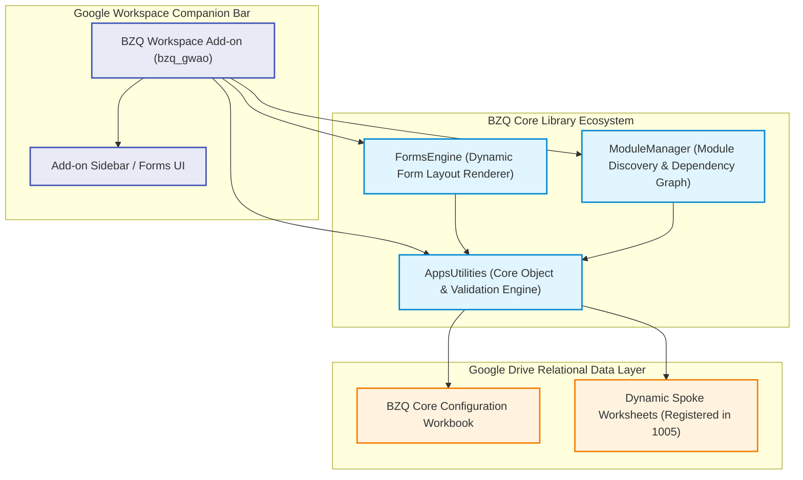
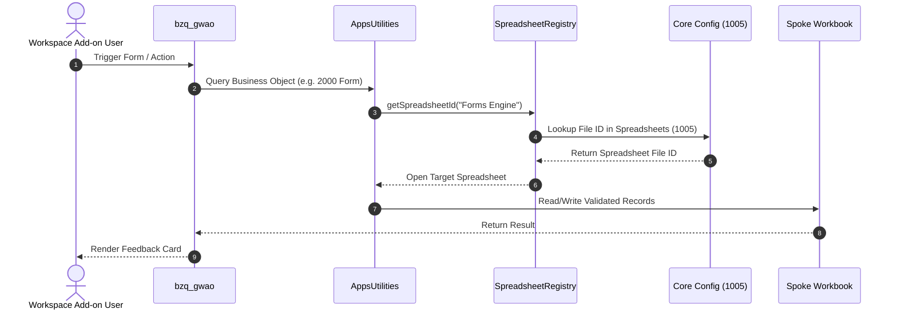

# BZQ ERP Architecture & Services Map

This document serves as the foundational architectural specification for **BZQ ERP**. It details the platform subsystems, Google Workspace Add-on (GWAO) integration patterns, dynamic Google Drive database models, and library dependency hierarchies.

---

## 1. Architectural Overview

BZQ ERP is a modular enterprise resource planning platform engineered natively for Google Workspace. It combines a centralized **Google Workspace Add-on (`bzq_gwao`)**, a decoupled suite of **Apps Script Libraries**, and a dynamic **Google Drive / Google Sheets Data Layer**.

---

## 2. Core Subsystems & Directory Map

| Subsystem / Directory | Role & Business Purpose | Object Range | Dependencies |
| :--- | :--- | :--- | :--- |
| **[`bzq_gwao`](../bzq_gwao)** | **Google Workspace Add-on Host**: CardService UI controller rendering companion sidebars in Google Sheets and Drive. | *Consumer Shell* | `AppsUtilities`, `FormsEngine`, `ModuleManager` |
| **[`AppsUtilities`](../AppsUtilities)** | **Core Engine & Data Layer**: Object registry, sequence generation, relational lookups, validation, and spreadsheet management. | `1000` – `1999` | *None (Root Library)* |
| **[`FormsEngine`](../FormsEngine)** | **Form Layout & UI Engine**: Dynamic HTML form generation, field validation, and modal entry handlers. | `2000` – `2999` | `AppsUtilities` |
| **[`ModuleManager`](../ModuleManager)** | **Module Lifecycle & Graphing**: Dynamic module discovery, dependency graphing, and topological initialization. | `3000` – `3999` | `AppsUtilities` |
| **[`BZQ-cli`](../BZQ-cli)** | **Development Toolchain**: Local CLI (`./bzq`) for clasp synchronization, environment bootstrapping, and database seeding. | *CLI Tooling* | Node.js, `@google/clasp` |

---

## 3. Dynamic Google Drive Relational Data Layer

Instead of relying on hardcoded sheet containers, BZQ ERP implements a dynamic file registry:

1. **Central Configuration Workbook (`BZQ Core Configuration`)**:
   - Resides in the environment's designated Google Drive root folder.
   - Houses the master metadata registries:
     - `SequenceConfiguration` (`1000`)
     - `ObjectConfiguration` (`1001`)
     - `LookupConfiguration` (`1002`)
     - `DropdownConfiguration` (`1003`)
     - `GlobalDropdownConfiguration` (`1004`)
     - `Spreadsheets` (`1005`)
     - `ConfigurationProperties` (`1006`)

2. **Dynamic Spoke Workbooks**:
   - Each domain module (or group of modules) stores operational data in spoke workbooks.
   - All spoke workbooks are recorded dynamically in the `Spreadsheets` object (`1005`) upon initialization.
   - `SpreadsheetRegistry` resolves file IDs at runtime via `Spreadsheets` lookup formulas (`BZQ_GET_OBJECT_VALUE`).

---

## 4. Code Cleanliness Constraints & Standards

All BZQ ERP codebases strictly enforce the following engineering constraints:

- **Function Length**: Hard limit of **20 lines** per function. Refactor longer operations into single-purpose private helper functions.
- **Argument Cap**: Maximum of **3 positional parameters**. Functions requiring more inputs must accept a structured options object.
- **Horizontal Width**: Strict maximum of **120 characters** per line.
- **Cyclomatic Complexity**: Nested loops must not exceed 2 levels deep.
- **Purity & Immutability**: Functions must be pure and avoid mutating global state or input parameters.
- **Strict Typing & Explicit Schemas**: Untyped generic objects across public boundaries are forbidden. Modules must declare explicit schemas and metadata in `Objects.js`.

---

## 5. Module Development & Extension Model

To create a new domain module (e.g. Order Management, Invoicing):
1. Allocate a unique stable ID range (e.g. `4000` – `4999`).
2. Follow the directory layout and specification detailed in [`docs/MODULE_SPECIFICATIONS_AND_STANDARDS.md`](./MODULE_SPECIFICATIONS_AND_STANDARDS.md).
3. Export object definitions via `getObjects_<ModuleName>()` in `Objects.js`.
4. Provide initial seed records in `Data.js`.
5. Deploy and register via `./bzq install-module <ModuleName> <ENV> <PARENT_ID>`.
