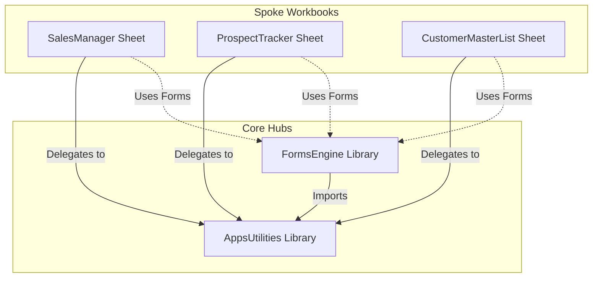

# Biz Qops Architecture & Services Map

This document serves as the central architectural reference for **Biz Qops**. It outlines the role of each service (Apps Script project), their container sheets, script IDs, and how they interact.

---

## 🏗️ Core Architecture Overview

Biz Qops is built around a **Hub-and-Spoke library model**:
1. **Core Hubs (`AppsUtilities` & `FormsEngine`)**: Houses the shared business logic, configuration managers, data formatting, and UI generation engines. These are imported as Apps Script Libraries.
2. **Spoke Sheets (`SalesManager`, `ProspectTracker`, etc.)**: Independent Google Sheets representing specific business objects. They contain thin wrapper scripts (`Triggers.js`) that forward all spreadsheet events and menu actions to the core hubs.



---

## 📂 Services & Project Directory Map

| Project / Folder Name | Role / Purpose | Script ID | Container Spreadsheet ID | Dependencies |
| :--- | :--- | :--- | :--- | :--- |
| **[AppsUtilities](file:///Users/mitchgarner/source/repos/ESR-Biz_Qops/AppsUtilities)** | **Core Library** (Sequencing, formatting, configuration, and cell validation context) | `1KsqYmH746evWxO20E850u_JFcUlRZW-jQsTz5CY7m-UpriQXNa8_xYnY` | `1SyMoGrqy7_JdQ2VbUwsv6ALvMmX9765mKZRJK8pYkew` | *None* |
| **[FormsEngine](file:///Users/mitchgarner/source/repos/ESR-Biz_Qops/FormsEngine)** | **HTML Forms Renderer** (Creates and handles modal entry forms schemas) | `12KlTGCao0iLOAwB0QaBpn-MWcveFUifSgOQCCJpXRtUPtajUdje8uzSi` | `1nMPXL_ymuZFbN7fZ-3wEieWoZo7SKDfN5PhIi2AbBf8` | `AppsUtilities` |
| **[extension_scaffold](file:///Users/mitchgarner/source/repos/ESR-Biz_Qops/extension_scaffold)** | **Workspace Add-on Scaffold** (Homepages, card translation UI, auto-registration) | *Standalone* | *None* | `AppsUtilities`, `FormsEngine` |
| **[SalesManager](file:///Users/mitchgarner/source/repos/ESR-Biz_Qops/SalesManager)** | Spoke Sheet (Manages sales pipeline records) | `1r5-u6Rrlp3rqCzwGUHYojr_-BjQVMs4VF9d0RPCkFKIjg4k_RtJUsvjm` | `19zAfGMSdSvbakvCrv96s7aJXhUsjQ39lp1tJTCY8czA` | `AppsUtilities`, `FormsEngine` |
| **[ProspectTracker](file:///Users/mitchgarner/source/repos/ESR-Biz_Qops/ProspectTracker)** | Spoke Sheet (Manages prospective sales leads) | `1zhn7oRgGXSw-SqAz-MTf35kFQamFwgVNCP4-5UDoCiw5iQHrikQ5gCqv` | *Spreadsheet Container* | `AppsUtilities`, `FormsEngine` |
| **[CustomerMasterList](file:///Users/mitchgarner/source/repos/ESR-Biz_Qops/CustomerMasterList)** | Spoke Sheet (Master customer repository) | `18MBkb_PQPStw8rGoecimiLVJQPVaz7oQH31BTnbDDKZLLgWov7coq8Sb` | *Spreadsheet Container* | `AppsUtilities`, `FormsEngine` |

> [!NOTE]
> For details on the new centralized Workspace Add-on architecture and migration path, refer to the [Workspace Extension Architecture](file:///Users/mitchgarner/source/repos/ESR-Biz_Qops/docs/WORKSPACE_EXTENSION_ARCHITECTURE.md) design document.

---

## ⚙️ Trigger Delegation & Integration Patterns

Spoke workbooks must delegate their simple and installable triggers back to `AppsUtilities` in order to use sheet formatting, auto-sequencing, and validation features. 

### 1. Simple Trigger Delegation
Every Spoke workbook defines simple triggers in a unified `Triggers.js` file:
```javascript
function onOpen() {
  AppsUtilities.onOpen(this); // Passes 'this' to bind the container sheet scope
}

function onEdit(e) {
  AppsUtilities.onEdit(e);
}
```

### 2. Menu & Installable Callback Delegation
Custom menu items created by `AppsUtilities.onOpen()` resolve in the container's global scope. Spoke sheets use standard proxy callbacks in their local `Triggers.js` file:
* **`triggerAddRecordToActivePage()`** -> Delegates to `AppsUtilities.triggerAddRecordToActivePage()`
* **`triggerValidateSelectedRows()`** -> Delegates to `AppsUtilities.triggerValidateSelectedRows()`
* **`appInit_setupInstallableTrigger()`** -> Delegates to `AppsUtilities.appInit_setupInstallableTrigger()`
* **`triggerResetConfigurationCache()`** -> Delegates to `AppsUtilities.triggerResetConfigurationCache()`
* **`triggerSetHeaderFormat()`** -> Delegates to `AppsUtilities.triggerSetHeaderFormat()`
* **`triggerSetRecordFormat()`** -> Delegates to `AppsUtilities.triggerSetRecordFormat()`
* **`triggerApplyHeaderFormat()`** -> Delegates to `AppsUtilities.triggerApplyHeaderFormat()`
* **`triggerApplyRecordFormat()`** -> Delegates to `AppsUtilities.triggerApplyRecordFormat()`
* **`appInit_onOpenInstallable(e)`** -> Delegates to `AppsUtilities.appInit_onOpenInstallable(e)`
* **`appInit_onEditInstallable(e)`** -> Delegates to `AppsUtilities.appInit_onEditInstallable(e)`

---

## 📋 Best Practices for Adding a Spoke Sheet

1. **Clone the Spoke Sheet locally:**
   ```bash
   ./bzq pull <folderName> <scriptId>
   ```
2. **Add core libraries in `appsscript.json`:**
   Reference `AppsUtilities` and `FormsEngine` script IDs in the dependencies block (with `developmentMode: true`).
3. **Establish `Triggers.js`:**
   Provide the forwarding trigger proxies and callback definitions targeting the `AppsUtilities` library.
4. **Deploy configuration & run setup:**
   - Define the sheet's business object and header configurations in the `__ObjectConfiguration` sheet of the core `AppsUtilities` configuration spreadsheet.
   - Inside the new workbook, select `ManageBusiness` -> `Admin` -> `Initialize Application` to register the installable triggers.

---

## 🧹 Code Cleanliness & Constraints

To maintain lightweight, highly scannable, and maintainable extensions, the codebase adheres to the following constraints (defined in [agent.md](file:///Users/mitchgarner/source/repos/ESR-Biz_Qops/agent.md)):
* **Function Length**: Hard limit of 20 lines of code per function.
* **Argument Cap**: Maximum of 3 positional parameters. If a function requires more than 3 parameters, they must be encapsulated into a single configuration/parameter object.
* **Line Length**: Maximum of 120 characters per line.
* **Purity**: Functions should be pure and avoid mutating global states or input arguments wherever possible.

### Parameter Object Pattern
When functions require multiple inputs (e.g. `ValidationContext.processRecordEdit`), they accept a single configuration object:
```javascript
// Example parameter object pattern
static processRecordEdit(params) {
  const { spreadsheet, sheetName, range, objConfig, forceValidation } = params;
  // ...
}
```

---

## 🛑 Deprecation Strategy

Unused global wrappers, legacy trigger entrypoints, and test functions are marked with JSDoc `@deprecated` annotations. 
- **Format**: Each deprecated function includes the date of deprecation and the earliest date it is safe to remove (no sooner than 6 months after deprecation).
- **Removal**: Human developers and AI assistants (like Gemini) can safely prune these deprecated functions on or after the safe removal date without risking breaking changes.

Example:
```javascript
/**
 * Global function to process validation on edit events.
 * @deprecated Deprecated on 2026-06-24. Will be obsolete and safe to remove on or after 2026-12-24.
 * Use RecordManager.processRecordEdit directly.
 */
function validationContext_processRecordEdit(e) {
  RecordManager.processRecordEdit(e);
}
```
