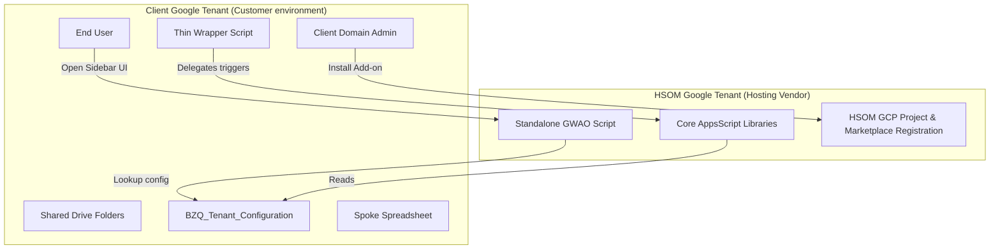

# BZQ Deployment and Application Lifecycle Management (ALM)

This document describes how the BZQ Google Workspace Add-on (GWAO) and underlying libraries are deployed, updated, and managed across multiple client environments.

---

## 1. Architectural Comparison: Model A vs. Model B

| Dimension | Model A: Centralized Marketplace (SaaS-like) | Model B: Private Domain Deployments (Enterprise) |
| :--- | :--- | :--- |
| **GCP Project Ownership** | Managed entirely by BZQ Vendor (**HSOM**). | Managed by the **Client's IT Admin**. |
| **Script Files Location** | Single script file in **HSOM's Drive**. | Copy of script files in **Client's Drive/Shared Drive**. |
| **User Setup Overhead** | **Zero**. Install from Workspace Marketplace. | **High**. Pull, deploy via CLI, manage credentials. |
| **Custom Code Ability** | Limited to Sheet configuration and bound overrides. | Full core engine modification and custom backend integrations. |
| **OAuth Consent Screen** | Configured and verified once by **HSOM**. | Configured and verified internally by the **Client**. |

---

## 2. Model A (SaaS) In-Depth Architecture

In Model A, the client's administrative overhead is eliminated. The entire platform operates in a zero-IT footprint setting.



### Script and Storage Locations
* **The GWAO Code**: Lives inside a single script project hosted in the **HSOM Google Drive**. No Apps Script files containing UI code are copied or deployed to the client's Drive.
* **Registry Pointer (`BZQ Tenant Link [ENV]`)**: To prevent the add-on from storing individual tenant IDs centrally or on an external database, BZQ uses a lightweight pointer file inside the client's own Google Drive. This pointer stores their private Configuration Spreadsheet ID. The add-on dynamically locates this file on launch, reads the ID, and caches it in `PropertiesService.getUserProperties()` for ultra-fast, compliance-friendly configuration resolution.
* **Client Data**: The client's Drive contains only standard Spreadsheets (the configurations workbook `BZQ_Tenant_Configuration` and various spoke sheets).
* **Bound Scripts (Wrapper)**: If thin container-bound triggers are used on spoke spreadsheets (for fast edit triggers), these exist as script files inside the client's spreadsheets. However, they are **static code skeletons** copied automatically from templates. They reference the HSOM libraries and never need to be modified by the client.

### GCP Project & OAuth Ownership
* **Single GCP Project**: Every client tenant does **not** need a GCP project. There is exactly **one** GCP project managed by HSOM.
* **Marketplace registration**: HSOM registers the Add-on in the Google Workspace Marketplace SDK within that single GCP project.
* **Consent Handshake**: When an end-user starts the add-on, Google Workspace presents the OAuth consent window associated with HSOM's GCP project. Once the user clicks "Allow", Google binds the auth token to the user's active Workspace session.

### Execution Context & Cost Allocation ("Processing Ownership")
One of Apps Script's greatest architectural benefits is its distributed execution model:
* **The Quota Owner**: When a user runs a sidebar function, executes a macro, or fires a trigger, Google bills the runtime execution time (e.g., the 6-minute daily script runtime limit) and API quotas (such as `UrlFetchApp` daily quotas or Gmail limits) against the **active client user's Google Account**.
* **Zero Host Cost**: HSOM hosts the source code, but **bears zero compute or execution costs**. All processing limits are distributed and scaled naturally across the client's own Google Workspace billing tier.

---

## 3. Application Lifecycle Management (ALM)

### Versioning & Updates

#### 1. Core Engine and UI Updates (Managed by HSOM)
When a new feature or patch is released:
* **UI Changes**: HSOM updates the GWAO project and publishes a new deployment version to the Google Workspace Marketplace SDK. Google Workspace automatically propagates this UI update to all active sidebars within a few hours.
* **Library Changes**: HSOM pushes new versions of `AppsUtilities` or `FormsEngine` libraries.
  - In production, libraries are pinned to **stable version numbers** (e.g. `version: 5`). 
  - To roll out minor bug fixes, HSOM increments the library version. Clients automatically inherit patches when we update the Marketplace Add-on manifest to point to the new version.

#### 2. Spoke Trigger ALM
Because spoke spreadsheets contain thin `Triggers.js` wrapper files, updating the core logic does not require modifying the spreadsheets:
* The wrapper file calls:
  ```javascript
  function onEditTrigger(e) {
    AppsUtilities.handleSpokeEdit(e);
  }
  ```
* When `AppsUtilities` is updated on HSOM's servers, all spoke sheets instantly inherit the updated logic on their next edit event without modifying the spreadsheet.

---

## 4. Model B (Private Deployments) In-Depth Architecture

For companies requiring complete code ownership or custom local development:
1. **Repository Cloning**: The company forks/clones the BZQ codebase.
2. **Project Initialization**: Developers use the BZQ CLI to initialize private script projects in their own Shared Drive folders:
   ```bash
   ./bzq init extension_scaffold <folder-id>
   ```
3. **GCP Linking**: They link the projects to their own internal company GCP project:
   ```bash
   ./bzq link-gcp extension_scaffold <company-gcp-project-id>
   ```
4. **Internal Distribution**: They publish the Add-on as a **Private App** inside their organization's private Workspace Marketplace.
5. **ALM Responsibility**: The client's development team handles updating the script projects when new versions of BZQ are released upstream.

---

## 5. Security Hardening and Namespace Protection

To guarantee complete environment isolation and prevent employees from spoofing the system configuration:
1. **DLP Rules**: Admins should establish Google Workspace Data Loss Prevention (DLP) or Drive Security Rules to lock down the BZQ namespace, preventing regular users from naming files `BZQ Tenant Link*` or `BZQ Core Configuration*`.
2. **Access Control**: Keep the production Configuration Spreadsheet inside an Admin-controlled Shared Drive or folder with **Viewer (Read-Only)** access for general staff.

For full, step-by-step configuration steps, refer to [Admin Security Hardening and DLP Guidelines](ADMIN_SECURITY_HARDENING.md).
