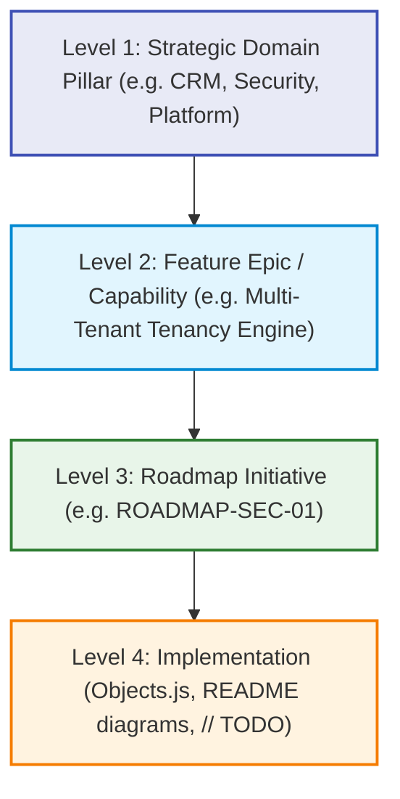

# BZQ ERP Top-Down Product Roadmap

This document establishes the master top-down product architecture and initiatives registry for **BZQ ERP**. It connects strategic domain pillars down to functional epics, module specifications, and source code implementations.

---

## 1. Top-Down Hierarchy & Traceability

Every development task in BZQ connects top-down from strategic pillars to code-level implementations:

---

## 2. Strategic Domain Pillars

BZQ ERP is structured across 11 core functional domains:

| Pillar Code | Domain Name | Scope & Core Responsibilities |
| :--- | :--- | :--- |
| **`PLT`** | **Platform Core & Utilities** | Add-on Shell (`bzq_gwao`), `AppsUtilities`, `ModuleManager`, caching, CLI. |
| **`SEC`** | **Security & Multi-Tenancy** | Organization segregation, OAuth security, role-based ACLs, audit trails. |
| **`FIN`** | **Financials & Accounting** | General Ledger, Chart of Accounts, AP/AR, Invoicing, Tax, Multi-Currency. |
| **`SCM`** | **Supply Chain & Inventory** | Warehousing, Stock Moves, Purchasing, Vendors, Bill of Materials (BOM). |
| **`CRM`** | **Customer Relationships** | Accounts, Contacts, Leads, Opportunities, Quotes, Customer Portals. |
| **`PMO`** | **Project Management** | Projects, Milestones, Tasks, Timesheets, Resource Planning, Gantt charts. |
| **`HRM`** | **Human Resource Management**| Employee Directory, Org Chart, Departments, Time Off, Payroll. |
| **`POS`** | **Point of Sale & Retail** | Registers, fast checkout UI, barcode scanner, shift reconciliations. |
| **`INT`** | **Integrations & Webhooks** | Google Workspace bridges (Gmail/Drive/Calendar), REST APIs, ETL sync. |
| **`AI`** | **AI & Intelligent Logic** | Contextual agents, automated parsing, predictive lead scoring, OCR. |
| **`MOB`** | **Mobile & Responsive UI** | Responsive viewports, card layouts, offline caching strategies. |

---

## 3. Initiative Lifecycle Statuses

Every roadmap initiative follows standard open-source governance:

1. **`Backlog`**: Ingested idea, categorized by domain, not yet scheduled.
2. **`Planned`**: Prioritized and scheduled to a target phase or milestone.
3. **`In Progress`**: Active development with atomic documentation and diagram synchronization.
4. **`On Hold`**: Blocked or deferred with documented rationale.
5. **`Completed`**: Shipped, tested, deployed, in use, and 100% documented with structural diagrams.
6. **`Canceled`**: Deprecated or superseded with documented rationale.

---

## 4. Master Initiatives Registry

| Tracking ID | Domain | Epic / Capability | Status | Target Milestone | Description & Acceptance Criteria | Module Scope | Code Reference |
| :--- | :--- | :--- | :--- | :--- | :--- | :--- | :--- |
| **`ROADMAP-PLT-01`** | `PLT` | Setup Wizard Core | `Planned` | Phase 1 (GWAO) | Interactive setup wizard card for admin provisioning. | `bzq_gwao` | `bzq_gwao/AddonHomepages.js` |
| **`ROADMAP-PLT-02`** | `PLT` | Central DB Creation | `Planned` | Phase 2 (GWAO) | Add-on-driven Drive workbook creation & parent folder resolution. | `AppsUtilities` | `AppsUtilities/SpreadsheetManager.js` |
| **`ROADMAP-PLT-03`** | `PLT` | Dynamic Delta-Seeder | `Planned` | Phase 4 (GWAO) | Cross-module relational delta-seeding engine. | `ModuleManager` | `ModuleManager/ModuleManager.js` |
| **`ROADMAP-PLT-04`** | `PLT` | Data Validation Engine | `Backlog` | Post-Launch | Centralized Sheets Data Validation engine for dates & numbers. | `FormsEngine` | `FormsEngine/FormsEngine.js` |
| **`ROADMAP-PLT-05`** | `PLT` | Query & Data Cache | `Backlog` | Post-Launch | High-performance cached query engine for multi-tab datasets. | Platform Core | `AppsUtilities/DataCache.js` |
| **`ROADMAP-SEC-01`** | `SEC` | OAuth Scope Audit | `Planned` | Marketplace Review | Automated OAuth scope minimization and token refresh audits. | `bzq_gwao` | `bzq_gwao/appsscript.json` |
