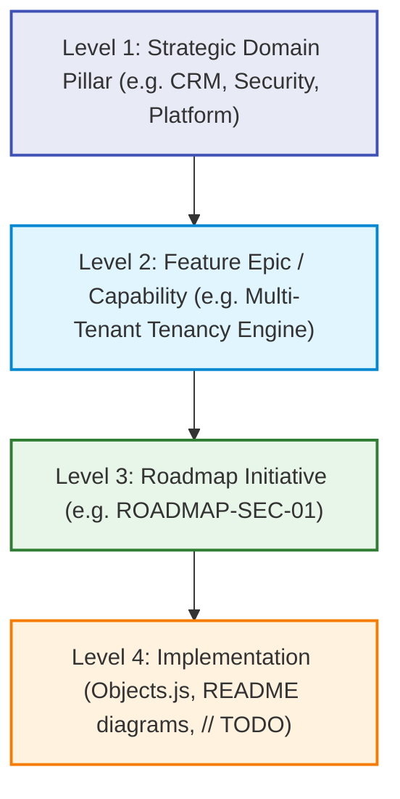

# BZQ ERP Top-Down Product Roadmap

This document establishes the master top-down product architecture and initiatives registry for **BZQ ERP**. It connects strategic domain pillars down to functional epics, module specifications, and source code implementations.

---

## 1. Top-Down Hierarchy & Traceability

Every development task in BZQ connects top-down from strategic pillars to code-level implementations:

```mermaid
graph TD
    classDef pillar fill:#e8eaf6,stroke:#3f51b5,stroke-width:2px;
    classDef epic fill:#e1f5fe,stroke:#0288d1,stroke-width:2px;
    classDef init fill:#e8f5e9,stroke:#2e7d32,stroke-width:2px;
    classDef code fill:#fff3e0,stroke:#f57c00,stroke-width:2px;

    L1["Level 1: Strategic Domain Pillar (e.g. CRM, Security, Platform)"]:::pillar
    L2["Level 2: Feature Epic / Capability (e.g. Multi-Tenant Tenancy Engine)"]:::epic
    L3["Level 3: Roadmap Initiative (e.g. ROADMAP-SEC-01)"]:::init
    L4["Level 4: Implementation (Objects.js, README diagrams, // TODO)"]:::code

    L1 --> L2
    L2 --> L3
    L3 --> L4
```

---

## 2. Strategic Domain Pillars

BZQ ERP is structured across 12 core functional domains:

| Pillar Code | Domain Name | Scope & Core Responsibilities |
| :--- | :--- | :--- |
| **`PLT`** | **Platform Core & Utilities** | Add-on Shell (`bzq_gwao`), `AppsUtilities`, `ModuleManager`, caching, CLI. |
| **`SEC`** | **Security & Multi-Tenancy** | Organization segregation, OAuth security, role-based ACLs, audit trails. |
| **`FIN`** | **Financials & Accounting** | General Ledger, Chart of Accounts, AP/AR, Invoicing, Tax, Multi-Currency. |
| **`SCM`** | **Supply Chain & Inventory** | Warehousing, Stock Moves, Purchasing, Vendors, Bill of Materials (BOM). |
| **`MFG`** | **Manufacturing & Logistics** | Work orders, routing, production schedules, quality control, maintenance. |
| **`CRM`** | **Customer Relationships** | Accounts, Contacts, Leads, Opportunities, Quotes, Customer Portals. |
| **`PMO`** | **Project Management** | Projects, Milestones, Tasks, Timesheets, Resource Planning, Gantt charts. |
| **`HRM`** | **Human Resource Management**| Employee Directory, Org Chart, Departments, Time Off, Payroll. |
| **`POS`** | **Point of Sale & Retail** | Registers, fast checkout UI, barcode scanner, shift reconciliations. |
| **`INT`** | **Integrations & Webhooks** | Google Workspace bridges (Gmail/Drive/Calendar), REST APIs, ETL sync. |
| **`AI`** | **AI & Intelligent Logic** | Contextual agents, automated parsing, predictive lead scoring, OCR. |
| **`MOB`** | **Mobile & Responsive UI** | Responsive viewports, card layouts, offline caching strategies. |

---

## 3. Initiative Lifecycle Statuses

Every roadmap initiative follows standard open-source governance:

1. **`Backlog`**: Ingested idea, categorized by domain, not yet scheduled.
2. **`Planned`**: Prioritized and scheduled to a target phase or milestone.
3. **`In Progress`**: Active development with atomic documentation and diagram synchronization.
4. **`On Hold`**: Blocked or deferred with documented rationale.
5. **`Completed`**: Shipped, tested, deployed, in use, and 100% documented with structural diagrams.
6. **`Canceled`**: Deprecated or superseded with documented rationale.

---

## 4. Master Initiatives Registry

### 4.1 Platform Core & Utilities (`PLT`)

| Tracking ID | Epic / Capability | Status | Target Milestone | Description & Acceptance Criteria | Module Scope | Code Reference |
| :--- | :--- | :--- | :--- | :--- | :--- | :--- |
| **`ROADMAP-PLT-01`** | Host Add-on Setup Wizard | `Planned` | Alpha (GWAO) | Interactive setup wizard card for admin provisioning and root folder creation. | `bzq_gwao` | `bzq_gwao/AddonHomepages.js` |
| **`ROADMAP-PLT-02`** | Central DB & Workbook Provisioning | `Planned` | Alpha (GWAO) | Automated Drive workbook creation, parent folder resolution, and spoke registration. | `AppsUtilities` | `AppsUtilities/SpreadsheetManager.js` |
| **`ROADMAP-PLT-03`** | Dynamic Delta-Seeding Engine | `Planned` | Alpha (GWAO) | Relational cross-module delta-seeder and dependency resolver. | `ModuleManager` | `ModuleManager/ModuleManager.js` |
| **`ROADMAP-PLT-04`** | Formula Management (`Formula Columns`) | `Planned` | Alpha (GWAO) | Central metadata object (`1007`) managing Sheets array formulas and column formula injection. | `AppsUtilities` | `AppsUtilities/Objects.js` |
| **`ROADMAP-PLT-05`** | Column Protection (`Field Locks`) | `Planned` | Alpha (GWAO) | Central metadata object (`1008`) locking calculated and protected ranges against non-admins. | `AppsUtilities` | `AppsUtilities/Objects.js` |
| **`ROADMAP-PLT-06`** | Event Bus & Logic Routing (`TriggerEvents`)| `Planned` | Alpha (GWAO) | Central metadata object (`1009`) mapping record, menu, timing, and webhook events to module logic. | `AppsUtilities` | `AppsUtilities/Objects.js` |
| **`ROADMAP-PLT-07`** | Sheets Data Validation Engine | `Planned` | Alpha (GWAO) | Central metadata object (`1010`) enforcing cell validation types, warnings/rejections, and range limits. | `AppsUtilities` | `AppsUtilities/Objects.js` |
| **`ROADMAP-PLT-08`** | Dynamic Range Helper Functions | `Planned` | Alpha (GWAO) | In-sheet formulas (`BZQ_GET_COLUMN_RANGE(obj, field)`) for dynamic A1 notation calculations. | `AppsUtilities` | `AppsUtilities/CustomFunctions.js` |
| **`ROADMAP-PLT-09`** | Query Engine Data Store (`QG`) | `Backlog` | Beta Milestone | Drive-based query layer with mutex record locking, audit history, and fast reporting for Looker Studio. | Query Engine (`QG`) | `QueryEngine/QueryEngine.js` |
| **`ROADMAP-PLT-10`** | Entity Relationship Diagram (ERD) Generator | `Backlog` | Post-Beta | Automatic Crow's Foot ERD generation by crawling BZQ Objects and Lookups metadata. | ModuleManager | `ModuleManager/ERDGenerator.js` |
| **`ROADMAP-PLT-11`** | Relational Multiplicity Constraints | `Backlog` | Post-Beta | Enforce relationship cardinality (`0:1`, `1:1`, `0:*`, `*:*`) across object lookups. | `AppsUtilities` | `AppsUtilities/ValidationManager.js` |
| **`ROADMAP-PLT-12`** | Record Deletion Governance | `Backlog` | Post-Beta | Soft-delete vs hard-delete semantics and cascading delete policies. | `AppsUtilities` | `AppsUtilities/RecordManager.js` |
| **`ROADMAP-PLT-13`** | Conditional Formatting Rules Engine | `Backlog` | Production v1.0 | Centralized conditional formatting management across BZQ tenant worksheets. | `AppsUtilities` | `AppsUtilities/FormatManager.js` |

---

### 4.2 Artificial Intelligence & Intelligent Logic (`AI`)

| Tracking ID | Epic / Capability | Status | Target Milestone | Description & Acceptance Criteria | Module Scope | Code Reference |
| :--- | :--- | :--- | :--- | :--- | :--- | :--- |
| **`ROADMAP-AI-01`** | Spec-Driven Developer Agent Workflows | `In Progress` | Continuous ALM | Autonomous pairing with human review, 100% diagram coverage, and atomic doc sync. | Repository / ALM | `GEMINI.md` |
| **`ROADMAP-AI-02`** | BZQ Agent Skills & Custom Tooling Suite | `Planned` | Alpha/Beta | Specialized Antigravity/Gemini agent skills for metadata auditing, diagram validation, and code review. | CLI / Skills | `scripts/preview-docs.js` |
| **`ROADMAP-AI-03`** | Google Ecosystem & Dependency Sentinel | `Backlog` | Beta Milestone | Automated tracking and linting of breaking changes across Google Apps Script and Workspace APIs. | DevOps / CI | `scripts/check-dependencies.js` |
| **`ROADMAP-AI-04`** | End-User Gemini Business Context Agent | `Backlog` | Production v1.0 | Integration linking Google Gemini directly into tenant BZQ data context for natural language queries. | Add-on / Gemini | `bzq_gwao/GeminiAssistant.js` |
| **`ROADMAP-AI-05`** | Intelligent OCR & Document Parser | `Backlog` | Future Scope | Automated invoice, receipt, and packing slip data extraction into ERP staging objects. | AI / Integrations | `IntelligentOps/OCRParser.js` |

---

### 4.3 Security & Multi-Tenancy (`SEC`)

| Tracking ID | Epic / Capability | Status | Target Milestone | Description & Acceptance Criteria | Module Scope | Code Reference |
| :--- | :--- | :--- | :--- | :--- | :--- | :--- |
| **`ROADMAP-SEC-01`** | OAuth Scope Minimization & Audits | `Planned` | Marketplace Review | Automated OAuth scope minimization and token refresh audits. | `bzq_gwao` | `bzq_gwao/appsscript.json` |
| **`ROADMAP-SEC-02`** | Granular Multi-Tier Authorization (RBAC) | `Backlog` | Beta Milestone | Role-based access control across objects, fields, records, modules, and spoke sheets. | `AppsUtilities` | `AppsUtilities/SecurityManager.js` |
| **`ROADMAP-SEC-03`** | Compliance & SOC2 Architecture Alignment | `Backlog` | Enterprise v1.0 | Enterprise compliance controls, immutable audit trails, and data isolation policies. | Platform Core | `docs/ARCHITECTURE.md` |

