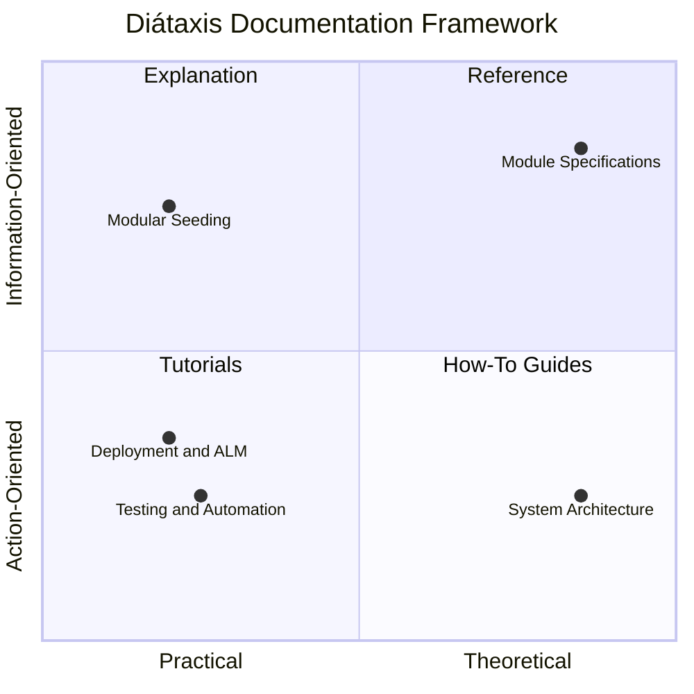

# BZQ ERP Documentation Index

Welcome to the official documentation for **BZQ ERP**. This documentation is structured using the **[Diátaxis Framework](https://diataxis.fr/)**, organizing technical resources into four distinct quadrants based on user needs, plus dedicated sections for Architecture, Roadmaps, and Module Specifications.

---

## 🧭 Navigation Map

### 1. 🎓 Tutorials (Learning-Oriented)
*Step-by-step learning journeys for onboarding developers:*
* **[Modular Seeding & Development Guide](./MODULAR_SEEDING_AND_DEVELOPMENT.md)**: ** NOTE: This seeding process is being replaced and is sunset for removal at any time ** End-to-end tutorial covering environment bootstrapping, cold deployments, schema delta-seeding, and building new modules.

---

### 2. 🛠️ How-To Guides (Task-Oriented)
*Practical guides solving specific operational and engineering problems:*
* **[Testing & Browser Automation](./TESTING_AND_BROWSER_AUTOMATION.md)**: Testing BZQ sidebars, dialogs, and spreadsheet integrations using Chrome DevTools MCP and viewport emulation.
* **[Deployment & ALM Guide](./DEPLOYMENT_AND_ALM.md)**: Step-by-step environment management, GCP project linking, and multi-tenant staging (ALPHA / BETA / PROD).
* **[Release Process & CI/CD Pipeline](./RELEASE_PROCESS_AND_ALM.md)**: GitHub Actions automation, semantic versioning, and private Google Workspace Marketplace publishing.
* **[Admin Security Hardening](./ADMIN_SECURITY_HARDENING.md)**: OAuth scope minimization, security controls, and enterprise data governance.

---

### 3. 📖 Reference (Information-Oriented)
*Technical specifications, schemas, APIs, and module metadata contracts:*
* **[Module Specifications & Standards](./MODULE_SPECIFICATIONS_AND_STANDARDS.md)**: Mandatory module directory layout, README specifications, `Objects.js` metadata contracts, and compiler validation rules.
* **Individual Module Reference Manuals**:
  * **[AppsUtilities Module Documentation](../AppsUtilities/README.md)**: Core Object schemas (`1000`–`1006`), sequence generator, and validation engines.
  * **[FormsEngine Module Documentation](../FormsEngine/README.md)**: Dynamic HTML form layouts, field schemas, and submission handling (`2000`).
  * **[ModuleManager Module Documentation](../ModuleManager/README.md)**: Module registry, dependency graphing, and topological resolution (`3000`–`3001`).
  * **[BZQ Workspace Add-on (`bzq_gwao`)](../bzq_gwao/README.md)**: Host application controller, CardService navigation, and companion sidebars.
  * **[BZQ CLI (`BZQ-cli`)](../BZQ-cli/README.md)**: Command reference, environment initialization, and clasp synchronization.

---

### 4. 💡 Explanation (Understanding-Oriented)
*Architectural discussions, design rationales, and background context:*
* **[BZQ ERP Architecture & Services Map](./ARCHITECTURE.md)**: System overview, dynamic Google Drive database models, and inter-module communication.
* **[Workspace Add-on Migration Architecture](./WORKSPACE_EXTENSION_ARCHITECTURE.md)**: Design rationale behind transitioning from container-bound scripts to a centralized Add-on.

---

### 5. 🗺️ Planning & Product Roadmaps
*Active development roadmaps, milestones, and strategic initiatives:*
* **[BZQ ERP Top-Down Product Roadmap](./PRODUCT_ROADMAP.md)**: Master product roadmap connecting 11 strategic domain pillars (`PLT`, `SEC`, `FIN`, `SCM`, `CRM`, `PMO`, `HRM`, `POS`, `INT`, `AI`, `MOB`) to epics, initiatives, and source code.
* **[Add-on Lifecycle & Dynamic Seeding Roadmap](./ADDON_LIFECYCLE_ROADMAP.md)**: Native GWAO lifecycle initialization, dynamic schema compilation, and query engine specifications.
