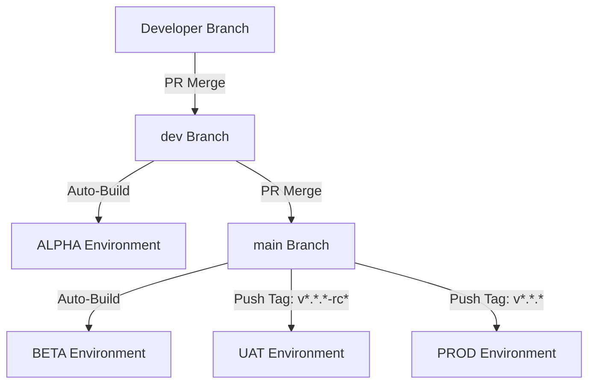

# BZQ Release Process and Application Lifecycle Management (ALM)

This document defines the release pipeline stages, environment structure, CI/CD automated configurations, identity migration processes, and Google Workspace Marketplace listing instructions for the BZQ Platform.

---

## 1. Environments and Git Release Workflow

To minimize branch merges and ensure that testing is performed on the exact code deployed to production, we use a **Git Tag-Based CI/CD Workflow**:



### Environment Overview

| Environment | Trigger | Scope & Visibility | Primary Use Case |
| :--- | :--- | :--- | :--- |
| **DEV** | CLI Local (`./bzq init`) | Developer's private Google Drive & testing sheets. | Individual sandbox coding and testing. |
| **ALPHA** | Git push/merge to `dev` | Private Workspace Marketplace (restricted list). | Nightly canary integrations and developer verification. |
| **BETA** | Git push/merge to `main` | Private Workspace Marketplace (restricted list). | Internal testing of production-quality features. |
| **UAT** | Git tag push: `v*.*.*-rc*` | Shared/Private Marketplace link (restricted domains). | Client verification and user acceptance testing. |
| **PROD** | Git tag push: `v*.*.*` | Public Workspace Marketplace. | Official client production environments. |

---

## 2. CI/CD Pipeline Configuration (GitHub Secrets)

The automated deployment pipeline defined in [.github/workflows/deploy.yml](../.github/workflows/deploy.yml) uses Git references to resolve target scripts.

To support this, the following secrets must be added to your GitHub Repository Settings (**Settings** -> **Secrets and variables** -> **Actions**):

### Authentication Secrets
* **`CLASPRC_JSON`**: The contents of your local `~/.clasprc.json` file. This authorizes the GitHub runner to act on behalf of your Google deployment account.

### Apps Script ID Secrets (Environment Payouts)
* **ALPHA**:
  - `SCRIPT_ID_UTILITIES_ALPHA`
  - `SCRIPT_ID_FORMS_ALPHA`
  - `SCRIPT_ID_SCAFFOLD_ALPHA`
* **BETA**:
  - `SCRIPT_ID_UTILITIES_BETA`
  - `SCRIPT_ID_FORMS_BETA`
  - `SCRIPT_ID_SCAFFOLD_BETA`
* **UAT**:
  - `SCRIPT_ID_UTILITIES_UAT`
  - `SCRIPT_ID_FORMS_UAT`
  - `SCRIPT_ID_SCAFFOLD_UAT`
* **PROD**:
  - `SCRIPT_ID_UTILITIES_PROD`
  - `SCRIPT_ID_FORMS_PROD`
  - `SCRIPT_ID_SCAFFOLD_PROD`

### Google Cloud Project Variables
Create these as **GitHub Actions Variables** (so they are visible in plaintext logs):
* `GCP_PROJECT_ID_ALPHA`
* `GCP_PROJECT_ID_BETA`
* `GCP_PROJECT_ID_UAT`
* `GCP_PROJECT_ID_PROD`

---

## 3. Clasp Identity Migration Guide

To transition publishing ownership from `ash@becomeestablished.com` to `ashleygarner@hsomadvisors.com` (so the Add-on can be published in HSOM's Google Cloud Workspace):

### Step 1: Transfer Google Drive Script File Permissions
1. Log into Google Drive as `ash@becomeestablished.com`.
2. Locate the master scripts and template spreadsheets.
3. Share the files/folders with `ashleygarner@hsomadvisors.com` as an **Editor** or transfer ownership entirely (if both accounts are under the same organizational parent domain).

### Step 2: Log out and Re-authenticate locally
On your development machine:
1. Revoke the old session:
   ```bash
   npx @google/clasp logout
   ```
2. Re-authenticate under the new corporate identity:
   ```bash
   ./bzq login
   ```
   *(Ensure you authorize using `ashleygarner@hsomadvisors.com` in the browser popup)*.

### Step 3: Refresh GitHub CI/CD Credentials
1. Retrieve the newly generated credentials from `~/.clasprc.json`.
2. Copy the entire file content and overwrite the **`CLASPRC_JSON`** secret inside your GitHub Repository settings.

---

## 4. Google Workspace Marketplace SDK Listing Guide

To make the Add-on available to users in Google Sheets and Google Drive:

### Step 1: Enable the API
1. Open the **[Google Cloud Console](https://console.cloud.google.com/)**.
2. Select the GCP project (e.g. your UAT or PROD project).
3. Search for **Google Workspace Marketplace SDK** in the API library and click **Enable**.

### Step 2: Configure App Integration
1. Inside the Google Workspace Marketplace SDK dashboard, click **App Integration**.
2. Set the **Extension Type** to: `Google Workspace Add-on`.
3. Paste the **Apps Script Deployment ID** of your target release (printed by `./bzq deploy` or your CI/CD log).
4. Under **OAuth Scopes**, add the exact scopes declared in [appsscript.json](../extension_scaffold/appsscript.json):
   - `https://www.googleapis.com/auth/spreadsheets`
   - `https://www.googleapis.com/auth/drive.file`
   - `https://www.googleapis.com/auth/drive.readonly`
   - `https://www.googleapis.com/auth/script.external_request`
   - `https://www.googleapis.com/auth/script.scriptapp`
   - `https://www.googleapis.com/auth/drive.addons.metadata.readonly`
   - `https://www.googleapis.com/auth/script.locale`

### Step 3: Configure Store Listing
1. Go to the **Store Listing** tab.
2. Select **App Visibility**:
   * **Public**: Available to any Google Workspace tenant globally (for PROD releases).
   * **Private**: Available only to users inside `hsomadvisors.com` or specific domains whitelist (for UAT/BETA/ALPHA testing).
3. Populate store assets:
   * **Language**: English (default).
   * **App Name**: BZQ ERP Workspace Extension.
   * **Descriptions**: Short description and detailed breakdown of BZQ's ERP extension capabilities.
   * **Graphics**: Icon (128x128px), Promotion Graphic (440x280px), and at least one Google Sheets/Drive sidebar screenshot.
4. Click **Publish** or **Submit for Review**.

---

## 5. BZQ Modular Seeding Framework

Each codebase module (Apps Script project folder) in the BZQ platform contains a designated `seed-data.json` file defining its database tables, properties, sequences, and configurations.

### Directory Structure of a Module
```text
{Module Name}/
├── appsscript.json
├── seed-data.json
└── {Source Files}.js
```

### seed-data.json Specification
The seed file defines a JSON dictionary mapping sheet names to data rows. For example, `AppsUtilities/seed-data.json` defines the core configurations, while `FormsEngine/seed-data.json` appends the `FORMS_ENGINE_ENABLED` flag.

```json
{
  "__ConfigurationProperties": [
    ["Configuration Key", "Value", "Notes"],
    ["FORMS_ENGINE_ENABLED", true, "Enables BZQ HTML Forms Engine layout parsing"]
  ]
}
```

### Dynamic Placeholders and Lookups Translation
During local development environment bootstrapping (`./bzq bootstrap-dev`), the installer:
1. **Discovers and Merges Seed Data**: Finds all `seed-data.json` files in the repository and merges them in dependency order.
2. **Prompts for Sequence Configurations**: Interactively queries the developer in the terminal for Prefix and Start overrides for all sequences defined in `__SequenceConfiguration`.
3. **Translates Lookups at Runtime**: Automatically detects and replaces template IDs (e.g. `xSC-10002`) with the customized sequence strings, maintaining all inter-object relations and formulas.

