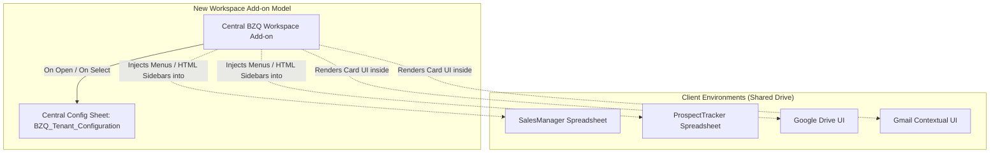
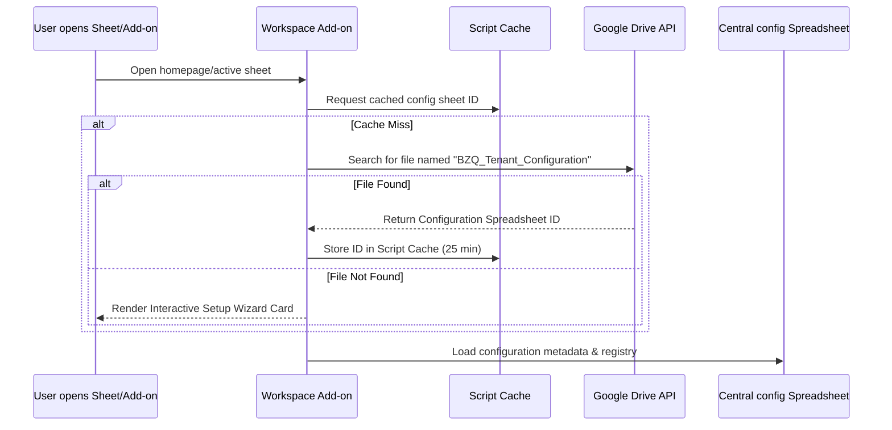
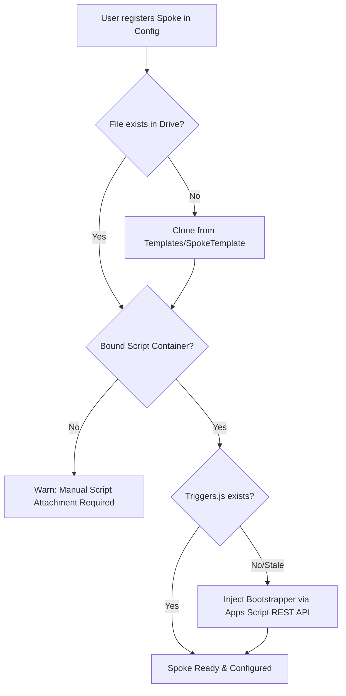
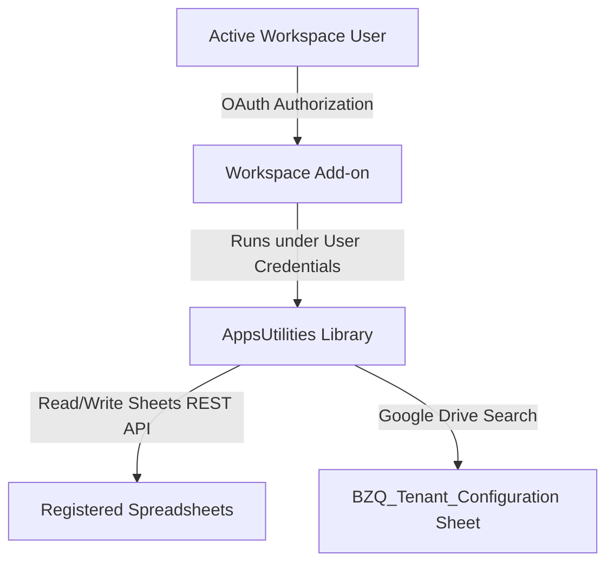
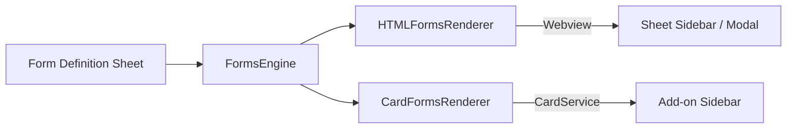
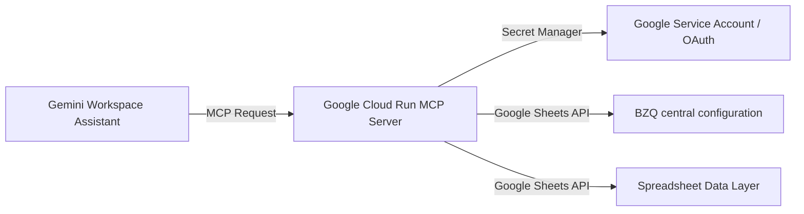

# Google Workspace Add-on Migration Architecture

This document defines the architectural design, migration path, and implementation decisions for transitioning the BZQ (BizChops) ERP platform from container-bound spreadsheet scripts to a centralized **Google Workspace Add-on (GWAO)** deployment model. 

* For production deployment strategies and application lifecycle management, see the [Deployment and ALM Guide](./DEPLOYMENT_AND_ALM.md).
* For development pipelines, CI/CD, and Google Workspace Marketplace listings, see the [Release Process and ALM Guide](./RELEASE_PROCESS_AND_ALM.md).

---

## 🏗️ Architectural Paradigm Shift

Historically, BZQ deployed distinct Apps Script projects bound to individual spreadsheet workbooks. Each spoke sheet contained a `Triggers.js` file forwarding events to the `AppsUtilities` library.

The new architecture migrates this model to a **Workspace Add-on** installed once at the domain (tenant) level. Note that BZQ will still support modularly deployed libraries/functionality to individual Apps Script objects within the tenant's Shared Drive, allowing the GWAO to operate as a central coordinator while retaining bound performance optimizations where needed.



### Key Advantages:
1. **Zero-Touch Provisioning**: Users and admins do not need to clone script projects or manually link `clasp` containers for new spreadsheets. Opening a sheet registered in the system automatically activates BZQ.
2. **Unified UI Scaffolding**: Card UI widgets render natively inside the sidebar of Gmail, Google Calendar, and Drive, while maintaining HTML forms for spreadsheet modals.
3. **Domain-Wide Governance**: Administrators can deploy BZQ to all organizational users in one click via Google Workspace Marketplace or private app publishing.

---

## ⚙️ Registry & Configuration Architecture

### The Central Registry Sheet (`__Spreadsheets`)
To eliminate hardcoded spreadsheet IDs, the configuration Properties workbook contains a dedicated **`__Spreadsheets`** page. 
* All managed spreadsheets are registered as records in `__Spreadsheets` (mapping `Spreadsheet ID` to its target modules).
* The `__ObjectConfiguration` sheet references the `__Spreadsheets` sheet via lookups to dynamically identify object locations.

### GWAO Central Registry Resolution Flow
To locate the configuration database, the Add-on scans Google Drive:



### Interactive Setup Wizard Card Flow
If the `BZQ_Tenant_Configuration` sheet cannot be found, the Add-on renders a Setup & Provisioning card:
1. **Interactive Provisioning**: Prompts the user to click a button to automatically clone the BZQ central configuration sheet template.
2. **Folder Selection Integration**: Integrates Google Picker or guides the user to select a folder in a **Shared Drive** where they want to place the configuration workbook.
3. **Google Workspace Marketplace Integration**: Aligns with Google's future interactive installation tooling by providing a Redirect Setup URL configured in the Marketplace SDK, guiding domain administrators through provisioning immediately after installation.
### Shared Drive Prioritization & Warnings
Placing any BZQ assets or configuration sheets into a user's personal My Drive should only be considered as a last resort.
* **Warning UI**: The Setup Wizard forces folder-selection workflows prioritizing **Shared Drives**. If the user proceeds with My Drive provisioning, a warning card is displayed: *"WARNING: You are deploying to a personal My Drive folder. Other organization members will not have access. We recommend deploying to a Shared Drive."*

---

## 📁 Spoke Provisioning & Automated Bootstrapping

To automate the setup of new spoke spreadsheets without manual user configuration:



1. **Folder Organization**: BZQ templates reside inside a dedicated folder named **`Templates`** located in the same Shared Drive directory as the `BZQ_Tenant_Configuration` sheet.
2. **Dynamic Spreadsheet Provisioning**:
   - If a registered spreadsheet does not exist, BZQ copies the template workbook (e.g. `Templates/SpokeTemplate`) into the target folder. The copy automatically inherits the pre-bound script container.
3. **Container script Verification & Injection**:
   - If a sheet exists but the bound Apps Script project is missing the `Triggers.js` bootstrapper, BZQ utilizes the **Google Apps Script REST API** programmatically.
   - Calling the `/v1/projects/{scriptId}/content` endpoint, BZQ injects the forwarding trigger skeleton directly into the script container without requiring clasp or CLI access.

---

## 🔐 Security, Authentication & Communication Flow

Understanding how the Workspace Add-on, container Apps Scripts, and spreadsheets communicate and authenticate:



1. **OAuth Authentication**: When the user installs or launches the Add-on, Google Workspace prompt-authorizes the OAuth scopes declared in `appsscript.json` (such as `spreadsheets`, `drive.file`, and `script.projects`). No manual API keys or secrets are required.
2. **Library Execution Context**: Apps Script Libraries (like `AppsUtilities`) run *in the context of the calling project*. When the GWAO calls `AppsUtilities.someFunction()`, it executes using the Add-on's properties service and the active user's permissions.
3. **Cross-Sheet Communications**: Authentication is inherited natively from the Google Session. If the active user has access to both the target spreadsheet and the central configuration spreadsheet (via Shared Drive permissions), the Apps Script execution succeeds seamlessly.

---

## 🔄 Custom Function Cache-Busting

Google Sheets aggressively caches the outputs of custom functions (`=MY_CUSTOM_FUNCTION(...)`). If configurations or lookup tables change, custom functions do not refresh automatically.

### Cache-Busting Pattern (`BZQ_CACHE_VERSION`)
To force automatic recalculation without manual reloading or cell edits:
1. We define a custom function `=BZQ_CACHE_VERSION()` that returns the current cache timestamp or version integer stored in the `CacheService`.
2. Any BZQ custom function that relies on external configurations accepts this function as an argument:
   ```excel
   =BZQ_GET_OBJECT_VALUE("Customer_A", "Email", BZQ_CACHE_VERSION())
   ```
3. When the configuration is updated, the cache version is incremented. Google Sheets detects that the third parameter has changed and automatically triggers recalculation for all cells referencing it.

---

## 🏗️ High-Level Architecture & User Administration Trade-offs

Is the Apps Script route the best option? Yes, for the following reasons:

| Criteria | Apps Script + Add-on Model (Proposed) | Direct API / Alternative SaaS Model |
| :--- | :--- | :--- |
| **GCP Project Management** | **Publisher Only**. End-users never touch a GCP project or configure credentials. | **Every Tenant Admin** must configure GCP credentials, service accounts, and API access keys. |
| **Hosting Costs** | **$0**. Free execution hosted within Google's native cloud. | **Monthly costs** for Cloud Run/container compute and Redis caching. |
| **Security Boundaries** | Stays within Google perimeter. Inherits Google Workspace IAM out of the box. | Requires establishing third-party OAuth redirect handlers and token stores. |

---

## 📦 Component Responsibility Matrix

To maintain clean modular boundaries, BZQ components are distributed across the libraries and the Add-on wrapper based on execution context.

| Component | Target Location | Rationale |
| :--- | :--- | :--- |
| **Workspace Add-on Wrapper** | Standalone Script | Handles manifest triggers (`onOpen`, homepages) and coordinates sheet authorization. Keeps no business logic. |
| **Card UI Translation Layer** | `FormsEngine` Library | Keeps forms compiling logic unified. `FormsEngine` determines both HTML sidebar forms and Card UI widget layouts. |
| **Central registry lookup** | `AppsUtilities` Library | Acts as the shared utility module that matches Spreadsheet IDs to enabled modules. |
| **Gemini MCP Server** | Google Cloud Run (Node.js) | Standalone Node.js service for MCP execution (bypasses Apps Script limits). |

---

## 🎛️ Card UI Translation Layer Design
To support both HTML forms in Sheet sidebars and native Card UI widgets in Google Drive/Gmail, the **FormsEngine** is enhanced with a dual-rendering engine.



### CardTranslationLayer.js Pattern
The compiler maps the forms spreadsheet rows (fields, types, validation) to `CardService` elements:
```javascript
// FormsEngine/CardTranslationLayer.js
class CardTranslationLayer {
  /**
   * Translates a form definition array into a CardService Card.
   * @param {string} title - The title of the form card.
   * @param {Array<Object>} fieldConfigs - Fields definitions retrieved from getFormDefinition_.
   * @returns {CardService.Card} The compiled Card UI object.
   */
  static compileToCard(title, fieldConfigs) {
    const card = CardService.newCardBuilder().setHeader(CardService.newCardHeader().setTitle(title));
    const section = CardService.newCardSection();

    fieldConfigs.forEach(config => {
      if (config.type === "TEXT" || config.type === "NUMBER") {
        section.addWidget(CardService.newTextInput()
          .setFieldName(config.field)
          .setTitle(displayName));
      } else if (config.type === "LOOKUP") {
        const input = CardService.newSelectionInput()
          .setType(CardService.SelectionInputType.DROPDOWN)
          .setFieldName(config.field)
          .setTitle(config.displayName);
        config.options.forEach(opt => input.addItem(opt, opt, opt === config.default));
        section.addWidget(input);
      }
    });
    
    // Add submit button actions
    section.addWidget(CardService.newTextButton()
      .setText("Submit")
      .setOnClickAction(CardService.newAction().setFunctionName("handleCardSubmit")));

    return card.addSection(section).build();
  }
}
```

---

## 🤖 Gemini MCP Integration Architecture
To surface ERP business objects to Gemini Workspace assistants, we follow Google Cloud best practices.

### Why a Supplemental Service?
Running an MCP server directly inside Apps Script Web Apps (`doGet`/`doPost`) is discouraged due to:
* **Cold Starts & Execution Limits**: Apps Script has significant startup times and a 6-minute execution limit.
* **Concurrency Limitations**: Apps Script cannot handle high concurrent HTTP traffic efficiently.
* **Library Limitations**: Apps Script lacks support for modern NPM packages like the official `@modelcontextprotocol/sdk`.

### Proposed MCP Architecture
We deploy a lightweight Node.js/TypeScript service on **Google Cloud Run** that bridges Gemini with Google Sheets data.



1. **Gemini Communication**: The Cloud Run service implements the standard Model Context Protocol (MCP) spec.
2. **Access & Security**: It authenticates using Google Workspace Domain-Wide Delegation (acting as the user) or a dedicated Service Account, calling Google Sheets REST APIs directly.
3. **Low Latency Caching**: The Node.js service keeps an in-memory Redis cache (or memory cache) of spreadsheet object coordinates and registry data, returning results to Gemini in milliseconds.

---

## 🔄 Parallel Migration Strategy
To ensure zero operational disruption during the transition, the BZQ platform supports parallel operations:

1. **Step-by-step rollout**: 
   * Active spoke workbooks can continue using their bound container triggers (`Triggers.js`) calling the `AppsUtilities` library.
   * Developers can install the new GWAO in developer mode.
2. **Graceful Yielding**:
   * The GWAO's `onOpen` hook inspects the active spreadsheet.
   * If a sheet has bound container triggers, GWAO can either:
     * Stand down and let the local script handle menu generation to avoid duplicate UI menu entries.
     * Enable Drive/Gmail sidebars while delegating sheet-bound sidebar UI strictly to the container script.
3. **Phased Cutover**:
   * Once GWAO validation is complete, the admin registers the workbook in the GWAO registry.
   * The bound container trigger code is deprecated and safely deleted during the next scheduled cleanup cycles.
4. **Triggers / Menus** | Container Scripts | Standard menus in the Spreadsheet menu bar and edit triggers must still be bound to workbooks. |


---

## 🚀 Setup, Installation & Deployment Guide

Follow these steps to deploy and register BZQ.

### 1. Developer Mode Guide (For Coding Agents & Developers)
To test local changes immediately in Google Sheets/Drive without publishing:
1. **Initialize script container**:
   ```bash
   ./bzq pull extension_scaffold <script-id>
   ```
   *(If initializing for the first time, run `clasp create` or `./bzq login` first).*
2. **Deploy modifications**:
   ```bash
   ./bzq push extension_scaffold
   ./bzq deploy extension_scaffold "v1.0.0 Developer Release"
   ```
3. **Install and Test via Test Deployments**:
   * Open the Apps Script project editor: [https://script.google.com/d/180Z9oAaNeouz_qF7U-qGL65rckWAb7_AUChQTUPNbB3YdiycLg4Y8ODw/edit](https://script.google.com/d/180Z9oAaNeouz_qF7U-qGL65rckWAb7_AUChQTUPNbB3YdiycLg4Y8ODw/edit)
   * In the top-right toolbar, click the **Deploy** button and select **Test deployments**.
   * Under the **BZQ ERP Workspace Extension** section, click **Install** next to the Sheets/Drive targets.
   * Open or refresh Google Sheets/Drive; the BZQ Add-on icon will now render in the right-side utility panel!

---

### 2. Production Rollout Guide (For End-Users & Domain Administrators)
To perform a domain/tenant-wide deployment for the entire organization:
1. **Link the Script to your GCP Project**:
   * Get your organization's Google Cloud Project ID.
   * Run the CLI link command:
     ```bash
     ./bzq link-gcp extension_scaffold <gcp-project-id>
     ```
2. **Configure OAuth Consent**:
   * Navigate to the GCP console OAuth Consent Screen setting.
   * Configure the user support email and scopes matching `appsscript.json`.
3. **Enable Marketplace SDK**:
   * In the GCP Console, search for and enable the **Google Workspace Marketplace SDK** API.
   * Navigate to the SDK's configuration tab.
   * Select **Workspace Add-on** integration and supply the deployment ID.
4. **Publish Privately to Tenant**:
   * Under the Publishing tab, select **Private Deployment** (makes it visible only to users inside your specific Google Workspace domain).
   * Click **Publish**.
5. **Domain-Wide Install**:
   * The domain administrator opens the Google Workspace Admin Console (`admin.google.com`).
   * Navigates to **Apps** -> **Google Workspace Marketplace apps** -> **Apps list**.
   * Clicks **Install App** under the tenant's private Add-on repository to automatically push BZQ to all team members.

